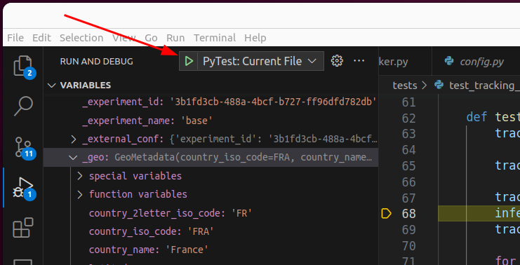

# Contributing to Code Carbon

(New to open-source? [Here's a guide to help you](https://opensource.guide/how-to-contribute/))

<!-- TOC start (generated with https://github.com/derlin/bitdowntoc) -->

- [Contributing to Code Carbon](#contributing-to-code-carbon)
  - [ Have a Question?](#-have-a-question)
  - [ Found a Bug?](#-found-a-bug)
  - [ Have a Feature Request?](#-have-a-feature-request)
  - [Alternative ways of contributing](#alternative-ways-of-contributing)
  - [ Ready to Contribute!](#-ready-to-contribute)
    - [Installation](#installation)
    - [Some UV commands](#some-uv-commands)
    - [Tests](#tests)
    - [Stress your computer](#stress-your-computer)
    - [Update all dependancies](#update-all-dependancies)
    - [Branching and Pull Requests](#branching-and-pull-requests)
    - [Debug in VS Code](#debug-in-vs-code)
    - [Coding style \&\& Linting](#coding-style--linting)
    - [Dependencies management](#dependencies-management)
    - [Build Documentation 🖨️](#build-documentation-️)
    - [Release process](#release-process)
      - [Test the build in Docker](#test-the-build-in-docker)
  - [API and Dashboard](#api-and-dashboard)
    - [CSV Dashboard](#csv-dashboard)
    - [Web dashboard](#web-dashboard)
    - [API](#api)
    - [Test the API](#test-the-api)
    - [Restore database from a production Backup](#restore-database-from-a-production-backup)
    - [Deployment](#deployment)
      - [API](#api-1)
      - [Dashboard](#dashboard)
  - [License](#license)

<!-- TOC end -->


<!-- TOC --><a name="have-a-question"></a>
## </a> Have a Question?

Please see the [FAQ](https://mlco2.github.io/codecarbon/faq.html) for questions.


<!-- TOC --><a name="found-a-bug"></a>
## </a> Found a Bug?

If you've identified a bug in `codecarbon`, please [submit an issue](#issue) to the GitHub repo: [mlco2/codecarbon](https://github.com/mlco2/codecarbon/issues/new). Please also feel free to submit a PR with a fix for the bug!


<!-- TOC --><a name="have-a-feature-request"></a>
## </a> Have a Feature Request?

Feel free to describe your request by [submitting an issue](#issue) documenting the feature (with its intent) and a PR with a proposed implementation of the feature.

Before submitting a new issue, please search the issues to make sure there isn't a similar issue already.
New issues can be created within the [GitHub repo](https://github.com/mlco2/codecarbon/issues/new).

<!-- TOC --><a name="alternative-ways-of-contributing"></a>
## Alternative ways of contributing

You have a cool idea, but do not know know if it fits with Code Carbon? You can create an issue to share:

-   the code, via the Github repo or [Binder](https://mybinder.org/), to share executable notebooks
-   a webapp, using [Voilà](https://github.com/voila-dashboards/voila), [Dash](https://github.com/plotly/dash) or [Streamlit](https://github.com/streamlit/streamlit)
-   ideas for improvement about the tool or its documentation

<!-- TOC --><a name="ready-to-contribute"></a>
## </a> Ready to Contribute!


<!-- TOC --><a name="installation"></a>
### Installation

CodeCarbon is a Python package, to contribute to it, you need to have Python installed on your machine, natively or with [UV](https://github.com/astral-sh/uv).

Between April 2024 and July 2025 we use Hatch for managing development environment. Since August 2025 we use UV manages the environments, Python versions, and dependencies - it's a fast, reliable way to work with Python projects.

We have dropped support of Python 3.6 since version 2.0.0 of CodeCarbon.

Please install [UV](https://github.com/astral-sh/uv) following [installation instructions](https://docs.astral.sh/uv/getting-started/installation/#standalone-installer).

Then, clone the repository and create the environment with:

```sh
git clone https://github.com/mlco2/codecarbon.git
cd codecarbon
uv sync
uv run task pre-commit-install
```

<!-- TOC --><a name="some-uv-commands"></a>
### Some UV commands

UV simplifies Python package management with fast, reliable commands:

```sh
# Show dependencies
uv tree
# Add a default dependency
uv add pandas
# Add a dev dependency
uv add --dev pytest
# Add a dependency for an extra feature
uv add --optional api logfire[fastapi]
# List all task for CodeCarbon
uv run task -l
# Run a specific version of python
uv run --python 3.14 codecarbon monitor
```

<!-- TOC --><a name="tests"></a>
### Tests

You can run the unit tests by running UV in the terminal when in the root package directory:

```sh
uv run task test-package
```

Run a specific test file:

```sh
uv run python -m pytest tests/test_cpu.py
```

You can also run a specific test:

```sh
uv run python -m unittest tests.test_your_feature.YourTestCase.test_function
```

For example: `uv run python -m unittest tests.test_energy.TestEnergy.test_wraparound_delta_correct_value`

Some tests will fail if you do not set *CODECARBON_ALLOW_MULTIPLE_RUNS* with `export CODECARBON_ALLOW_MULTIPLE_RUNS=True` before running test manually.

To test the API, see [how to deploy it](#local_deployement) first.

Core and external classes are unit tested, with one test file per class. Most pull requests are expected to contain either new tests or test updates. If you are unusure what to test / how to test it, please put it in the pull request description and the maintainers will help you.


<!-- TOC --><a name="stress-your-computer"></a>
### Stress your computer

To test CodeCarbon, it is useful to stress your computer to make it use its full power:

-   7Zip is often already installed, running it with `7z b` makes a quick CPU test.
-   [GPU-burn](https://github.com/wilicc/gpu-burn) will load test the GPU for a configurable duration.
-   To test the CPU : `stress-ng --cpu 0 --cpu-method matrixprod --metrics-brief --rapl --perf -t 60s` See [our documentation](https://mlco2.github.io/codecarbon/test_on_scaleway.html) to install it.
-   To do useful computation while testing [Folding At Home](https://foldingathome.org/) is a good option.
-   [OCCT](https://www.ocbase.com/download) is a proprietary tool but free for non-commercial use and avaliable for Windows and Linux.

To monitor the power consumption of your computer while stressing it, you can use:

-   `nvidia-smi` is a useful tool to see the metrics of the GPU and compare it with CodeCarbon.
-   [powerstat](https://github.com/ColinIanKing/powerstat) can be used to see the metrics of the CPU and compare it with CodeCarbon. It's available on major distribution, like Debian-based Linux distributions with `sudo apt install powerstat`. Run it with `sudo powerstat -a -R 1 60`.


<!-- TOC --><a name="update-all-dependancies"></a>
### Update all dependancies

For multiple requirement files:
```sh
uv sync --upgrade
```

<!-- TOC --><a name="branching-and-pull-requests"></a>
### Branching and Pull Requests

To add a new feature to codecarbon, apply the following workflow:

-   Master branch is protected
-   To contribute to an already [prioritized](https://github.com/orgs/mlco2/projects/1) feature, you can create a branch from master and open a draft PR
-   Documenting the intent & the limits of a contribution in a dedicated issue or in the pull request helps the review
-   Once automated tests pass, the PR is reviewed and merged by the repository maintainers


<!-- TOC --><a name="debug-in-vs-code"></a>
### Debug in VS Code

Here is the launch.json to be able to debug examples and tests:

```json
{
    "version": "0.2.0",
    "configurations": [

        {
            "name": "Python: Current File",
            "type": "debugpy",
            "request": "launch",
            "program": "${file}",
            "console": "integratedTerminal",
            "justMyCode": true,
            "env": { "PYTHONPATH": "${workspaceRoot}" }
        },
        {
            "name": "PyTest: Current File",
            "type": "debugpy",
            "request": "launch",
            "module": "pytest",
            "args": [
                "-s",
                "${file}"
            ],
            "console": "integratedTerminal",
            "justMyCode": true,
            "env": { "PYTHONPATH": "${workspaceRoot}",
            "CODECARBON_ALLOW_MULTIPLE_RUNS": "True"  }
        },
        {
            "name": "PyTest: codecarbon monitor",
            "type": "debugpy",
            "request": "launch",
            "module": "codecarbon.cli.main",
            "args": [
                "monitor"
            ],
            "console": "integratedTerminal",
            "justMyCode": true,
            "env": { "PYTHONPATH": "${workspaceRoot}"}
        }
    ]
}
```

Then run opened test with this button:




<!-- TOC --><a name="coding-style-linting"></a>
### Coding style && Linting

The coding style and linting rules are automatically applied and enforced by [pre-commit](https://pre-commit.com/). This tool helps to maintain the same code style across the code-base such to ease the review and collaboration process. Once installed ([https://pre-commit.com/#installation](https://pre-commit.com/#installation)), you can install a Git hook to automatically run pre-commit (and all configured linters/auto-formatters) before doing a commit with `uv run task precommit-install`. Then once you tried to commit, the linters/formatters will run automatically. It should display something similar to:

```log
[INFO] Initializing environment for https://github.com/psf/black.
[INFO] Initializing environment for https://gitlab.com/pycqa/flake8.
[INFO] Installing environment for https://github.com/psf/black.
[INFO] Once installed this environment will be reused.
[INFO] This may take a few minutes...
[INFO] Installing environment for https://gitlab.com/pycqa/flake8.
[INFO] Once installed this environment will be reused.
[INFO] This may take a few minutes...
seed isort known_third_party.............................................Passed
isort....................................................................Failed
- hook id: isort
- files were modified by this hook

Fixing codecarbon/__init__.py

black....................................................................Passed
flake8...................................................................Passed
```

If any of the linters/formatters fail, check the difference with `git diff`, add the differences if there is no behavior changes (isort and black might have change some coding style or import order, this is expected it is their job) with `git add` and finally try to commit again `git commit ...`.

You can also run `pre-commit` with `uv run pre-commit run -v` if you have some changes staged but you are not ready yet to commit.


<!-- TOC --><a name="dependencies-management"></a>
### Dependencies management

Dependencies are defined in different places:

-   In [pyproject.toml](pyproject.toml#L28), those are all the dependencies.
-   In [uv.lock](uv.lock), those are the locked dependencies managed by UV, do not edit them.


<!-- TOC --><a name="build-documentation"></a>
### Build Documentation 🖨️

No software is complete without great documentation!
To make generating documentation easier, we use [Zensical](https://zensical.org/).

In order to make changes, edit the `.md` files in the `/docs` folder, and then run in root folder:

```sh
uv run --only-group doc task docs
```

to regenerate the html files. For local preview with live reload, run `uv run --only-group doc task docs-serve`.

### Rebase your branch on master 

Before creating a PR, please make sure to rebase your branch on master to avoid merge conflicts and make the review easier. You can do it with the following command:
```sh
# Be careful, this command will delete every local changes you have, make sure to commit or stash them before running it
TARGET_BRANCH=master
current_branch=$(git symbolic-ref --short HEAD)
git switch $TARGET_BRANCH && git pull
git switch $current_branch --force && git fetch origin $TARGET_BRANCH
git rebase $TARGET_BRANCH
```

In case of a conflict during a rebase, "incoming" refers to your branch, and "current" refers to master. This is because the commits from your branch are being applied to master, so they are incoming. In case of a merge, it's the opposite!

Check if everything is fine:

```sh
git status
```

Push force
```sh
git push --force-with-lease
```

### Rebase your branch on master 

Before creating a PR, please make sure to rebase your branch on master to avoid merge conflicts and make the review easier. You can do it with the following command:
```sh
# Be careful, this command will delete every local changes you have, make sure to commit or stash them before running it
TARGET_BRANCH=master
current_branch=$(git symbolic-ref --short HEAD)
git switch $TARGET_BRANCH && git pull
git switch $current_branch --force && git fetch origin $TARGET_BRANCH
git rebase $TARGET_BRANCH
```

In case of a conflict during a rebase, "incoming" refers to your branch, and "current" refers to master. This is because the commits from your branch are being applied to master, so they are incoming. In case of a merge, it's the opposite!

Check if everything is fine:

```sh
git status
```

Push force
```sh
git push --force-with-lease
```

<!-- TOC --><a name="release-process"></a>
### Release process

- Merge all PRs.
- Create a PR bumping the version with `uv run bumpver update --patch`. For a release candidate, use `uv run bumpver update --set-version 3.0.0_rc1`.
- Run `uv run python .github/pyproject_versions.py -c` to check version consistancy.
- Update the dependencies with `uv sync --upgrade`
- [Build Documentation](#build-documentation) with `uv run --only-group doc task docs`.
- Push the changes.
- Merge the PR.
- Wait for the Github Action `ReleaseDrafter` to finish running on the merge commit.
- [Edit the Draft release](https://github.com/mlco2/codecarbon/releases/) on Github and give it a tag, `v1.0.0` for the version 1.0.0. Github will automatically create a Git tag for it. Complete help [here](https://docs.github.com/en/repositories/releasing-projects-on-github/managing-releases-in-a-repository).
-   A [Github Action](https://github.com/mlco2/codecarbon/actions) _Upload Python Package_ will be run automaticaly to upload the package.

<!-- TOC --><a name="test-the-build-in-docker"></a>
#### Test the build in Docker

If you want to check the build is working, you could run:

```bash
rm dist/*
uv build
docker run -it --rm -v $PWD:/data python:3.13 /bin/bash
pip install pytest pytest-mock requests-mock responses pandas
pip install --no-cache-dir /data/dist/codecarbon-*.whl -U --force-reinstall
cp /data/tests/test_package_integrity.py .
pytest test_package_integrity.py
```

<!-- TOC --><a name="api-and-dashboard"></a>
## API and Dashboard

<!-- TOC --><a name="csv-dashboard"></a>
### CSV Dashboard

To run locally the dashboard application, you can use it out on a sample data file such as the one in `examples/emissions.csv`, and run it with the following command from the code base:

```bash
uv run --extra carbonboard task carbonboard --filepath="examples/emissions.csv"

# or, if you don't want to use UV
pip install codecarbon[carbonboard]
python codecarbon/viz/carbonboard.py --filepath="examples/emissions.csv"
```

> **Note:** The `viz-legacy` extra is deprecated but still works for backwards compatibility. It will be removed in v4.0.0. Please use `carbonboard` instead.

If you have the package installed, you can run the CLI command:

```bash
carbonboard --filepath="examples/emissions.csv" --port=8050
```

<!-- TOC --><a name="web-dashboard"></a>
### Web dashboard

To test the new dashboard that uses the API, run:

```sh
uv run  task local
```

Then, click on the url displayed in the terminal.

By default, the dashboard is connected to the production API, to connect it to your local API, you can set the environment variable `CODECARBON_API_URL` to `http://localhost:8008` :

```sh
export CODECARBON_API_URL=http://localhost:8008
uv run dashboard
```


<!-- TOC --><a name="api"></a>
### API

The easiest way to run the API locally is with Docker, it will set-up the Postgres database for you. Launch this command in the project directory:

```sh
uv run api.docker

# or

docker-compose up -d
```

Please see [Docker specific documentation](./docker/README.md) for more informations.
When up, the API documentation is available locally at the following URL: http://localhost:8008/redoc and can be used for testing.

If you want to run the API without Docker, you must first set the environment variables described in the .env.example file, and run the following command:

```sh
uv run api.local
```

In order to make codecarbon automatically connect to the local API, create a file `.codecarbon.config` with contents:

```
[codecarbon]
api_endpoint = http://localhost:8008
```

Before using it, you need an experiment_id, to get one, run:

```
codecarbon login
```

It will ask the API for an experiment_id on the default project and save it to `.codecarbon.config` for you.

Then you could run an example:

```
python examples/api_call_debug.py
```

📝 Edit the line `occurence = 60 * 24 * 365 * 100` to specify the number of minutes you want to run it.


<!-- TOC --><a name="test-the-api"></a>
### Test the API

To test the API, you can use the following command:

```sh
uv run api.test-unit
```

```sh
export CODECARBON_API_URL=http://localhost:8008
uv run api.test-integ

```

<!-- TOC --><a name="restore-database-from-a-production-backup"></a>
### Restore database from a production Backup

```sh
docker cp postgresql_*.dump postgres_codecarbon:/tmp
docker exec -it postgres_codecarbon bash
export BACKUP_USER=upwnpbdktjvnoks0foxq
export BACKUP_DB=bnrwiktgr4hzukt1xseg
psql -U $POSTGRES_USER -d $POSTGRES_DB -c "CREATE USER $BACKUP_USER WITH PASSWORD '$POSTGRES_PASSWORD';"
psql -U $POSTGRES_USER -d $POSTGRES_DB -c "ALTER USER $BACKUP_USER CREATEDB;"
createdb -U $BACKUP_USER $BACKUP_DB
psql -U $BACKUP_USER -d $POSTGRES_DB -c "CREATE DATABASE $BACKUP_DB;"
pg_restore -d $BACKUP_DB -U $BACKUP_USER --jobs=8 --clean --create /tmp/postgresql_*.dump
psql -U $BACKUP_USER -d $BACKUP_DB -c "GRANT ALL PRIVILEGES ON ALL SEQUENCES IN SCHEMA public TO \"$POSTGRES_USER\";"
psql -U $POSTGRES_USER -d $BACKUP_DB -c "ALTER DATABASE $POSTGRES_DB RENAME TO \"$POSTGRES_DB-backup\";"
psql -U $BACKUP_USER -d $POSTGRES_DB-backup -c "ALTER DATABASE $BACKUP_DB RENAME TO $POSTGRES_DB;"
```

#### Clean the database

To remove orphans (elements without run) from the database, run:

```sql
CALL public.spcc_purgeduplicatedata();
```


<!-- TOC --><a name="deployment"></a>
### Deployment


<!-- TOC --><a name="api-1"></a>
#### API

The API is availiable to everyone from https://api.codecarbon.io, but if you want to deploy it for yourself, here are the instructions.

To deploy the API we use [Clever Cloud](https://www.clever-cloud.com/), an IT Automation platform. They manage all the hard ops work while we focus on the Code Carbon value.

Here is the Clever Cloud configuration if you want to reproduce it:

```conf
APP_FOLDER="carbonserver"
CC_PIP_REQUIREMENTS_FILE="requirements.txt"
CC_POST_BUILD_HOOK="cd $APP_HOME/carbonserver && python3 -m alembic -c carbonserver/database/alembic.ini upgrade head"
CC_PYTHON_BACKEND="uvicorn"
CC_PYTHON_MODULE="main:app"
CC_PYTHON_VERSION="3.8"
DATABASE_URL="postgresql://secret_do_not_publish_this"
PORT="8080"
```

_CC stand here for Clever Cloud, not Code Carbon_ 😉

To deploy,

```sh
git remote add deploy git+ssh://git@push-n2-par-clevercloud-customers.services.clever-cloud.com/app_<secret_do_not_share>.git
git push deploy master:master
```

Yeah, not so hard, is it?

See (the doc)[https://www.clever-cloud.com/doc/getting-started/quickstart/] for more informations.

Please note that Clever Cloud host Code Carbon for free because they like our project.


<!-- TOC --><a name="dashboard"></a>
#### Dashboard

Same as for the API, for example to deploy the branh `fix-unit` to CleverCloud:

```sh
git push clever-dashboard fix-unit:master
```

Config on CleverCloud:

```sh
APP_FOLDER="dashboard"
CC_PIP_REQUIREMENTS_FILE="requirements-dashboard.txt"
CC_PYTHON_MODULE="carbon_board_API:server"
CC_PYTHON_VERSION="3.8"
CODECARBON_API_URL="https://api.codecarbon.io"
PORT="8000"
```


<!-- TOC --><a name="license"></a>
## License

By contributing your code, you agree to license your contribution under the terms of the [MIT License](LICENSE).

All files are released with the MIT license.
