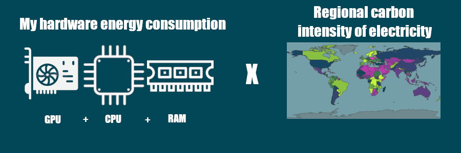
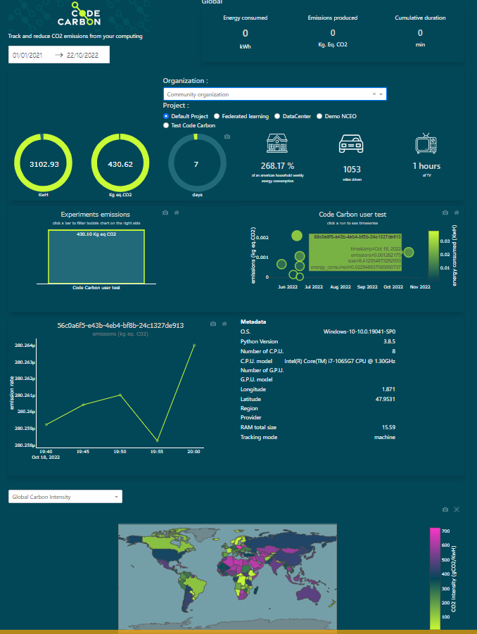

# Track & reduce CO₂ emissions from your local computing

Estimate and track carbon emissions from your computer, quantify and analyze their impact.

[](https://pypi.org/project/codecarbon/) [](https://zenodo.org/badge/latestdoi/263364731) [](https://scorecard.dev/viewer/?uri=github.com/mlco2/codecarbon) [](https://codecov.io/gh/mlco2/codecarbon)

- **A lightweight, easy to use Python library** – Simple API to track emissions
- **Open source, free & community driven** – Built by and for the community
- **Effective visual outputs** – Put emissions in context with real-world equivalents

> **Tracking GenAI API calls?** CodeCarbon measures emissions from **local computing** (your hardware). To track emissions from remote GenAI API calls (OpenAI, Anthropic, Mistral, etc.), use [**EcoLogits**](https://ecologits.ai/). Both tools are complementary.

## Installation

```bash
pip install codecarbon
```

If you use Conda:

```bash
conda activate your_env
pip install codecarbon
```

More installation options: [installation docs](https://docs.codecarbon.io/how-to/installation/).

## Quickstart (Python)

```python
from codecarbon import EmissionsTracker

tracker = EmissionsTracker()
tracker.start()

# Your code here

emissions = tracker.stop()
print(f"Emissions: {emissions} kg CO₂")
```

[**Learn more** →](https://docs.codecarbon.io/tutorials/first-tracking/)

## Quickstart (CLI)

Track a command without changing your code:

```bash
codecarbon monitor --no-api -- python train.py
```

Detect your hardware:

```bash
codecarbon detect
```

Full CLI guide: [CLI tutorial](https://docs.codecarbon.io/tutorials/cli/).

## Configuration

You can configure CodeCarbon using:

- `~/.codecarbon.config` (global)
- `./.codecarbon.config` (project-local)
- `CODECARBON_*` environment variables
- Python arguments (`EmissionsTracker(...)`)

Configuration precedence and examples: [configuration guide](https://docs.codecarbon.io/how-to/configuration/).

## How it works

We created a Python package that estimates your hardware electricity power consumption (GPU + CPU + RAM) and we apply to it the carbon intensity of the region where the computing is done.



We explain more about this calculation in the [**Methodology**](https://docs.codecarbon.io/explanation/methodology/) section of the documentation.

## Visualize

You can visualize your experiment emissions on the [dashboard](https://dashboard.codecarbon.io/) or locally with [carbonboard](https://docs.codecarbon.io/how-to/visualize/).



## Quick links

| Section | Description |
|---------|-------------|
| [Your First Tracking](https://docs.codecarbon.io/tutorials/first-tracking/) | Get started in minutes |
| [Installation](https://docs.codecarbon.io/how-to/installation/) | Install CodeCarbon |
| [CLI Tutorial](https://docs.codecarbon.io/tutorials/cli/) | Track emissions from the command line |
| [Python API Tutorial](https://docs.codecarbon.io/tutorials/python-api/) | Track emissions in Python code |
| [API Reference](https://docs.codecarbon.io/reference/api/) | Full parameter documentation |
| [Examples](https://docs.codecarbon.io/reference/examples/) | Example usage patterns |
| [Methodology](https://docs.codecarbon.io/explanation/methodology/) | How emissions are calculated |
| [EcoLogits](https://ecologits.ai/) | Track emissions from GenAI API calls |

## Links

- [Main website](https://codecarbon.io) to learn why we do this.
- [Dashboard](https://dashboard.codecarbon.io/) to see your emissions.
- [Documentation](https://docs.codecarbon.io/) to learn how to use the package and our methodology.
- [EcoLogits](https://ecologits.ai/) to track emissions from GenAI API calls (OpenAI, Anthropic, etc.).
- [GitHub](https://github.com/mlco2/codecarbon) to look at the source code and contribute.
- [Discord](https://discord.gg/GS9js2XkJR) to chat with us.

## Contributing

We are hoping that the open-source community will help us edit the code and make it better!

You are welcome to open issues, even suggest solutions and better still contribute the fix/improvement! We can guide you if you're not sure where to start but want to help us out.

Check out our [contribution guidelines](https://github.com/mlco2/codecarbon/blob/master/CONTRIBUTING.md).

Feel free to chat with us on [Discord](https://discord.gg/GS9js2XkJR).

## Citation

If you find CodeCarbon useful for your research, you can find a citation under a variety of formats on [Zenodo](https://zenodo.org/records/11171501).

<details>
<summary>BibTeX</summary>

```tex
@software{benoit_courty_2024_11171501,
  author       = {Benoit Courty and
                  Victor Schmidt and
                  Sasha Luccioni and
                  Goyal-Kamal and
                  MarionCoutarel and
                  Boris Feld and
                  Jérémy Lecourt and
                  LiamConnell and
                  Amine Saboni and
                  Inimaz and
                  supatomic and
                  Mathilde Léval and
                  Luis Blanche and
                  Alexis Cruveiller and
                  ouminasara and
                  Franklin Zhao and
                  Aditya Joshi and
                  Alexis Bogroff and
                  Hugues de Lavoreille and
                  Niko Laskaris and
                  Edoardo Abati and
                  Douglas Blank and
                  Ziyao Wang and
                  Armin Catovic and
                  Marc Alencon and
                  Michał Stęchły and
                  Christian Bauer and
                  Lucas Otávio N. de Araújo and
                  JPW and
                  MinervaBooks},
  title        = {mlco2/codecarbon: v2.4.1},
  month        = may,
  year         = 2024,
  publisher    = {Zenodo},
  version      = {v2.4.1},
  doi          = {10.5281/zenodo.11171501},
  url          = {https://doi.org/10.5281/zenodo.11171501}
}
```

</details>

## Contact

Feel free to chat with us on [Discord](https://discord.gg/GS9js2XkJR).

Codecarbon was formerly developed by volunteers from [**Mila**](http://mila.quebec) and the [**DataForGoodFR**](https://twitter.com/dataforgood_fr) community alongside donated professional time of engineers at [**Comet.ml**](https://comet.ml) and [**BCG GAMMA**](https://www.bcg.com/en-nl/beyond-consulting/bcg-gamma/default).

Now CodeCarbon is supported by [**Code Carbon**](https://www.helloasso.com/associations/code-carbon), a French non-profit organization whose mission is to accelerate the development and adoption of CodeCarbon.

### Star History

[](https://star-history.com/#mlco2/codecarbon&lfwa/carbontracker&sb-ai-lab/Eco2AI&fvaleye/tracarbon&Breakend/experiment-impact-tracker&Date)
