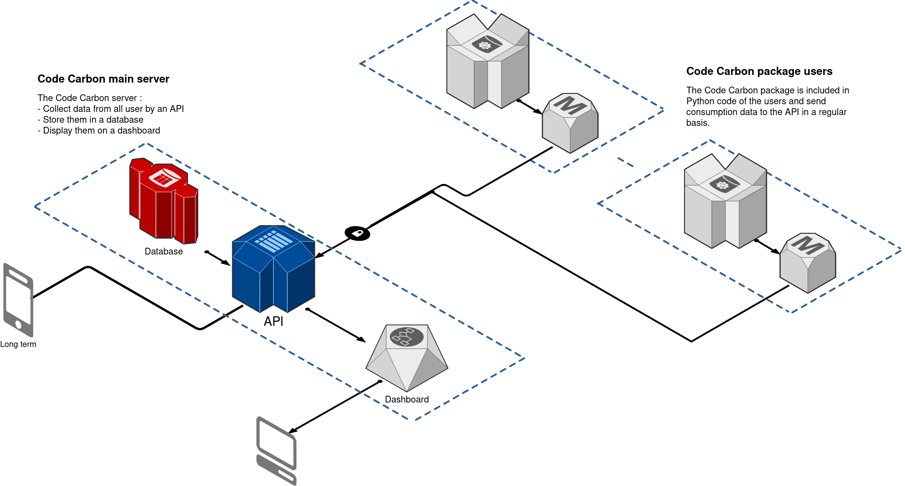
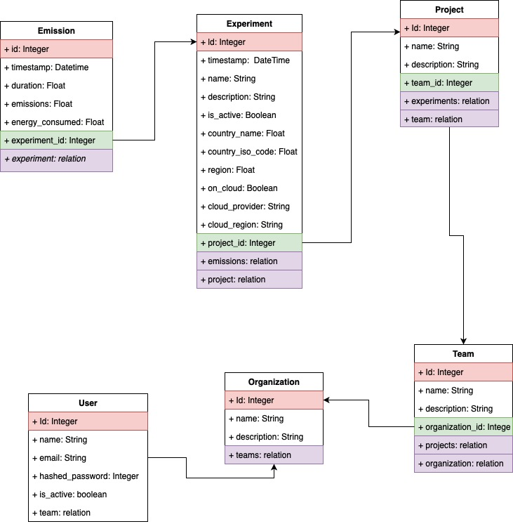

## Code Carbon architecture

Documentation:

- Routers handling: https://fastapi.tiangolo.com/tutorial/bigger-applications/
- Security: https://fastapi.tiangolo.com/tutorial/security/
- SQL: https://fastapi.tiangolo.com/tutorial/sql-databases/
- Alembic: https://youtu.be/36yw8VC3KU8
- Deploy a full stack FastAPI / Vue.js app: https://github.com/tiangolo/full-stack-fastapi-postgresql
- FastAPI + PG on docker: https://testdriven.io/blog/fastapi-docker-traefik
- FastAPI db dependency injection: https://python-dependency-injector.ets-labs.org/examples/fastapi-sqlalchemy.html

## Schema of the database

Container Dependencies injection: 

Database is a core part of the application, used with 2 different usages:
- Administration, with alembic to create / populate tables.
- Data persistence, for users data, through the HTTP layer.

The load of data would not be the same for those 2 usages, thus we must define 2 types of database connections for them.
To handle properly the connexion / session, we could define it as part of the infrastructure & keep in the database 
folder the high level functions that manipulates tested session building.
A software based on dependency injector: 
- https://github.com/bentoml/BentoML
