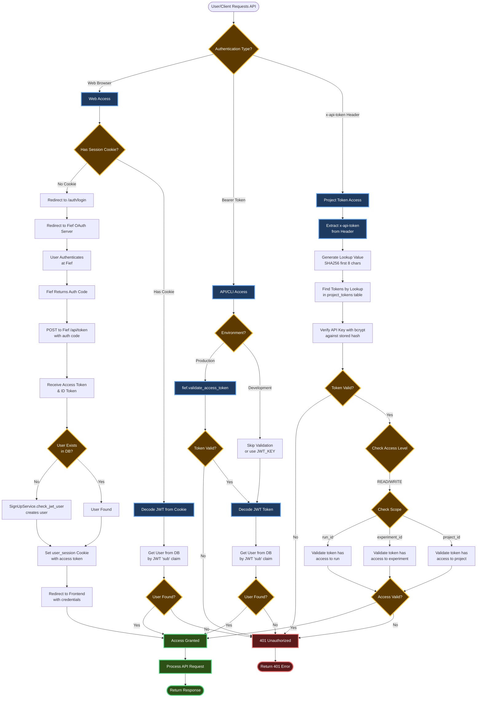

# CodeCarbon Server Authentication Flow

This diagram illustrates the authentication flow in the CodeCarbon API server (carbonserver).

## Authentication Methods

The server supports three authentication methods:

1. **OAuth2/Cookie-based (Web Browser)**: For web dashboard access using Fief OAuth
2. **Bearer Token (CLI/API)**: For programmatic access using JWT tokens
3. **API Key/Project Tokens**: For automated data submission using project-specific tokens

## Flow Diagram

## Key Components

### OAuth2 Web Flow
- Uses **Fief** as the OAuth2 provider
- Cookie name: `user_session`
- Auto-creates users in local DB on first login
- Scopes: `openid`, `email`, `profile`

### Bearer Token (CLI/API)
- JWT tokens validated via Fief in production
- Development mode allows test tokens with `JWT_KEY`
- Used by the `codecarbon` CLI tool

### Project Tokens (API Keys)
- Prefix: `cpt_` (codecarbon project token)
- Hashed with bcrypt for secure storage
- SHA256 lookup optimization (first 8 chars)
- Scoped to specific projects/experiments/runs
- Access levels: READ, WRITE

## Key Files

- `carbonserver/api/routers/authenticate.py` - Authentication routes
- `carbonserver/api/services/auth_service.py` - Auth dependency injection
- `carbonserver/api/services/signup_service.py` - User creation logic
- `carbonserver/api/infra/api_key_utils.py` - API key generation/verification
