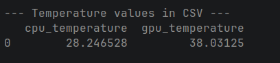

# Contributions

Added a function in Hardware.py that tracks cpu temps live in Celsius, this covers issue 1008

### Added code

``` python
def get_cpu_temperature(self) -> float:
        """
        Get average CPU temperature in Celsius.
        Supported on Linux (Intel + AMD) and Windows Intel via Power Gadget.
        Returns 0.0 if temperature cannot be read on the current platform.
        """
        try:
            if self._mode == "intel_power_gadget":
                all_cpu_details = self._intel_interface.get_cpu_details()
                for metric, value in all_cpu_details.items():
                    if re.match(r"^CPU Temperature", metric):
                        return float(value)
                return 0.0

            elif self._mode in ["intel_rapl", MODE_CPU_LOAD, "constant"]:
                temps = psutil.sensors_temperatures()
                if not temps:
                    logger.debug(
                        "get_cpu_temperature: psutil.sensors_temperatures() "
                        "returned no data on this platform"
                    )
                    return 0.0
                for key in ["coretemp", "k10temp", "cpu_thermal"]:
                    if key in temps:
                        readings = temps[key]
                        avg = sum(r.current for r in readings) / len(readings)
                        logger.debug(f"get_cpu_temperature: {key} avg = {avg:.1f}°C")
                        return avg
                return 0.0

        except Exception as e:
            logger.debug(f"get_cpu_temperature: Could not read CPU temperature: {e}")
            return 0.0
```
### Added Workflow

```python
name: Test Temperature Tracking

on:
  push:
    branches: [ main ]
  workflow_dispatch:

jobs:
  test-temperature:
    runs-on: ubuntu-latest

    steps:
      - uses: actions/checkout@v3

      - name: Set up Python
        uses: actions/setup-python@v4
        with:
          python-version: '3.11'

      - name: Install dependencies
        run: |
          pip install -e .
          pip install pandas

      - name: Check sensors available
        run: |
          sudo apt-get install -y lm-sensors
          python3 -c "import psutil; print('Sensors:', psutil.sensors_temperatures())"

      - name: Run temperature test
        run: |
          python3 -c "
          import time
          from codecarbon import EmissionsTracker

          tracker = EmissionsTracker(
              project_name='temperature_test',
              measure_power_secs=15,
              save_to_file=True,
              output_file='emissions_temp_test.csv',
              log_level='debug'
          )

          tracker.start()
          total = sum(range(10_000_000))
          time.sleep(30)
          emissions = tracker.stop()

          print(f'Emissions: {emissions:.6f} kg CO2')
          print(f'CPU temperature: {tracker.final_emissions_data.cpu_temperature:.1f}C')
          print(f'GPU temperature: {tracker.final_emissions_data.gpu_temperature:.1f}C')

          import pandas as pd
          df = pd.read_csv('emissions_temp_test.csv')
          print('CSV columns:', df.columns.tolist())
          print('Temperature values:')
          print(df[['cpu_temperature', 'gpu_temperature']])
          "
```

Allowed for CodeCarbon to track it and input it in to the CSV data set, shown in terminal below
{.align-center width="700px" height="400px"}

