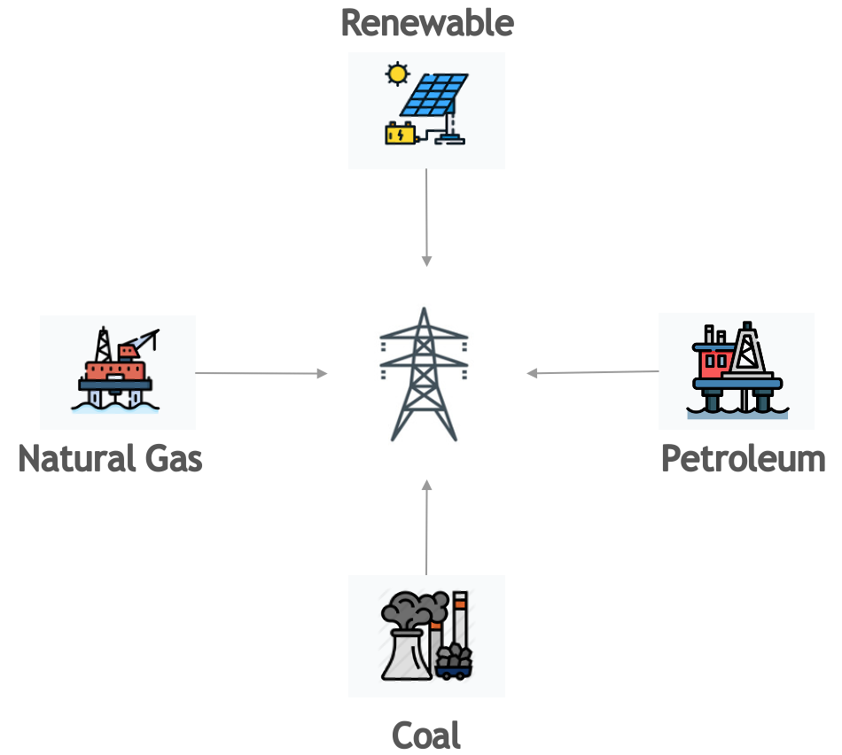

# Methodology

## The shape of the calculation

Emissions, expressed in kilograms of CO₂-equivalent (CO₂eq), are the product of
two factors:

```text
E = Energy consumed by the computational infrastructure, in kilowatt-hours
C = Carbon intensity of that electricity, in g CO₂ emitted per kilowatt-hour
```

```text
Emissions (kgCO₂eq) = E × C
```

CodeCarbon computes `E` by sampling CPU, GPU and RAM power at a fixed interval
and integrating over time, and resolves `C` from the machine's location or
cloud region. Both halves have fallbacks, and which fallback ran is what
determines how much you should trust the result.

Expanded, that is four terms:

```text
emissions = Σ_intervals (power × Δt × PUE) × carbon_intensity
```

- `power` — watts drawn by the CPU, GPU and RAM at the moment of sampling.
- `Δt` — the sampling interval, `measure_power_secs`, 15 seconds by default.
  Power × Δt is energy; summing over every interval gives the energy of the run.
- `PUE` — power usage effectiveness, an optional multiplier for datacentre
  overhead such as cooling. It defaults to 1.0, meaning no overhead assumed.
- `carbon_intensity` — grams of CO₂-equivalent emitted per kilowatt-hour on the
  grid the machine draws from.

`E` above is therefore the **PUE-inflated** energy: a `pue` you set is already
folded into every energy figure CodeCarbon reports, per component. This matters
when you do arithmetic with the CSV columns — see
[Power Usage Effectiveness](#power-usage-effectiveness-pue).

| Half of the formula | Best case | Worst case |
|---|---|---|
| `E` — energy | Hardware energy counters (RAPL, EMI, NVML) | A CPU model's catalogue TDP scaled by CPU load |
| `C` — carbon intensity | Live grid intensity from Electricity Maps | The 475 gCO₂eq/kWh world average |

Nothing in the output states which case applied to `C`. For `E`, the log line
emitted at startup names the CPU backend.

## Energy: what is measured, what is modelled

Power is sampled at `measure_power_secs`, default 15 seconds, configurable when
instantiating the tracker. Energy is the integral of power over time:
`Energy = Power × Time`.

| Component | Best available source | Modelled fallback |
|---|---|---|
| CPU | Intel RAPL (Linux), Energy Meter Interface (Windows 11), `powermetrics` (macOS), Intel Power Gadget (legacy) | TDP × CPU load, or a flat constant |
| GPU | NVML via `nvidia-ml-py` (Nvidia) or AMDSMI (AMD) — a direct device reading | none; without a supported GPU library, GPU is not counted |
| RAM | none — there is no RAM power counter | always modelled from an estimated DIMM count |

CodeCarbon does not separately model disk I/O, network transfer, displays,
cooling or other peripherals. Those are usually small for local, code-level
experiments, and they are not exposed through the same low-overhead interfaces.
They can matter for workloads dominated by data movement, storage or
distributed communication.

### Tracking modes

The `tracking_mode` parameter (`"machine"` or `"process"`, default
`"machine"`) controls the **scope** of attribution, independently of which
measurement backend was selected.

**Machine mode** measures the whole hardware stack. It is the straightforward
reading, and the right one on a dedicated machine.

**Process mode** estimates the share attributable to your Python process and
its children, by sampling their CPU time against total CPU capacity. This is a
software approximation — it does **not** read per-process hardware counters —
and is preferable on shared machines.

!!! warning "GPU is always machine-wide"

    Process mode affects CPU and RAM attribution only. GPU power is measured at
    the device level, so on a shared GPU CodeCarbon still attributes the
    **entire GPU's** consumption to your run.

!!! warning "On the estimation path, `tracking_mode` also changes the power model"

    When CodeCarbon falls back to `cpu_load` mode, `tracking_mode` selects not
    just the attribution scope but a **different power curve** — cubic with a
    10% floor for machine mode, linear with no floor for process mode. See
    [The two cpu_load models](#the-two-cpu_load-models). On the hardware-counter
    paths (RAPL, EMI, NVML) this does not apply.

### Power Usage Effectiveness (PUE)

If you set `pue`, it is applied inside the measurement loop to **each
component's energy** before accumulation
([`emissions_tracker.py:1194`](https://github.com/mlco2/codecarbon/blob/master/codecarbon/emissions_tracker.py#L1194)):

```python
energy *= self._pue
```

This means `cpu_energy`, `gpu_energy` and `ram_energy` in the CSV are **already
inflated by the PUE**, not just `energy_consumed` and `emissions`. Do not
multiply by PUE a second time when reusing the per-component columns. Water
consumption is derived from the post-PUE energy in the same loop.

## CPU

### Which backend gets chosen

This is the part of CodeCarbon most often misread. The selection logic is in
[`resource_tracker.py:249-279`](https://github.com/mlco2/codecarbon/blob/master/codecarbon/core/resource_tracker.py#L249),
and it is evaluated strictly in this order — the first row that applies wins.

Rows 1–9 are decided in that selector. If none of them matches, it delegates to
the `_setup_fallback_tracking` helper (`resource_tracker.py:159-219`), which is
where rows 10 and 11 are decided — hence the different line citations on the
last two rows.

| # | Condition | Result | Source |
|---|---|---|---|
| 1 | `force_cpu_power` is set | **Every platform backend is skipped** — RAPL is not consulted even if it is available — and your value becomes the TDP handed to row 10 or row 11 below. It is not the reported power. | `resource_tracker.py:255-260`, guard at `:272`, `:169-174` |
| 2 | `force_mode_cpu_load` is set, `psutil` present, and a TDP is known | `cpu_load` mode | `resource_tracker.py:263-270` |
| 3 | Linux **and** RAPL files readable | `intel_rapl` — hardware energy counters | `resource_tracker.py:223-225` |
| 4 | macOS **and** Apple Silicon **and** `psutil` present | `cpu_load` mode | `resource_tracker.py:228-230` |
| 5 | macOS **and** Apple Silicon **and** no `psutil` **and** `powermetrics` usable | `powermetrics` | `resource_tracker.py:231-233` |
| 6 | macOS **and** Intel **and** Intel Power Gadget installed | `intel_power_gadget` | `resource_tracker.py:234-236` |
| 7 | macOS **and** Intel **and** `powermetrics` usable | `powermetrics` | `resource_tracker.py:237-239` |
| 8 | Windows **and** EMI available | `windows_emi` — hardware energy counters | `resource_tracker.py:241-243` |
| 9 | Windows **and** Intel Power Gadget installed | `intel_power_gadget` | `resource_tracker.py:244-246` |
| 10 | none of the above, `psutil` present | `cpu_load` mode | `resource_tracker.py:179-190`, `:201-212` |
| 11 | none of the above, no `psutil` | `constant` mode | `resource_tracker.py:191-198`, `:213-218` |

Two consequences worth stating plainly, because they surprise people:

- **`force_cpu_power` disables hardware measurement, and it is not the reported
  power.** Setting it on a machine with working RAPL replaces a real counter
  with an estimate. Because `psutil` is a hard dependency, the estimate is
  normally `cpu_load` mode with your value as the TDP, so in machine mode
  `force_cpu_power=65` reports `65 × (0.1 + 0.9 × load³)` watts, between 6.5 W
  and 65 W, not a flat 65 W. Only on an installation without `psutil` does it
  become a flat figure, and then it is half your value, not your value
  (row 11 and `constant` mode below). Unlike a registry TDP, it is used as
  given: it is not multiplied by the CPU package count.
- **On Apple Silicon, `powermetrics` is effectively unreachable.**
  `psutil` is a hard dependency of CodeCarbon, so row 4 fires before row 5 in
  every normal installation. The `sudo`-granting instructions that used to
  appear here describe a path the code no longer takes.

### The fallback constants

When no hardware counter is available, CodeCarbon needs a power figure. It gets
one from the following ladder, in
[`core/cpu.py:1002-1032`](https://github.com/mlco2/codecarbon/blob/master/codecarbon/core/cpu.py#L1002):

| Situation | TDP used | Constant | Source |
|---|---|---|---|
| CPU model detected and present in the TDP registry (2000+ Intel and AMD parts) | the registry value | — | `cpu.py:1005-1012` |
| CPU model detected but **absent** from the registry, `psutil` present | `threads × 4 W` | `DEFAULT_POWER_PER_CORE = 4` | [`cpu.py:29`](https://github.com/mlco2/codecarbon/blob/master/codecarbon/core/cpu.py#L29), used at `:1024` |
| CPU model absent from the registry and no `psutil`, or the model could not be detected at all | `85 W` | `POWER_CONSTANT = 85` | [`hardware.py:23`](https://github.com/mlco2/codecarbon/blob/master/codecarbon/external/hardware.py#L23), applied at `:457` |

Whatever TDP results is multiplied by the physical CPU package count
(`resource_tracker.py:267`, `:278`) to give the machine-level ceiling.

That ceiling is then turned into an instantaneous power reading in one of two
ways, and **the two ways are not the same**:

- **`cpu_load` mode** — see the next section. **It uses two different power
  models depending on `tracking_mode`.**

- **`constant` mode** — reached only when `psutil` is unavailable — applies a
  flat half of TDP
  ([`hardware.py:363`](https://github.com/mlco2/codecarbon/blob/master/codecarbon/external/hardware.py#L363)):

    ```text
    power = TDP × CONSUMPTION_PERCENTAGE_CONSTANT   # CONSUMPTION_PERCENTAGE_CONSTANT = 0.5
    ```

    `CONSUMPTION_PERCENTAGE_CONSTANT = 0.5` is defined at
    [`hardware.py:26`](https://github.com/mlco2/codecarbon/blob/master/codecarbon/external/hardware.py#L26).

### The two cpu_load models

`cpu_load` mode does not have one power model. It has two, selected by
`tracking_mode` inside
[`_get_power_from_cpu_load`](https://github.com/mlco2/codecarbon/blob/master/codecarbon/external/hardware.py#L274)
(`hardware.py:274-352`). They differ in shape, not only in scope, and the
difference is large at low load.

| | `tracking_mode="machine"` | `tracking_mode="process"` |
|---|---|---|
| Load source | `psutil.cpu_percent()`, system-wide (`hardware.py:280-282`) | per-process CPU-time deltas over wall clock, summed across the process and its children (`hardware.py:294-330`) |
| Normalisation | none — already a 0–100% figure | divided by core count (`hardware.py:345`) |
| Curve | **cubic** (`hardware.py:287-288`) | **linear** (`hardware.py:346`) |
| Idle floor | **10% of TDP** | **none** — 0% load gives 0 W |

```python
# machine mode — hardware.py:287-288
load_factor = 0.1 + 0.9 * ((cpu_load / 100.0) ** 3)
power = tdp * load_factor
```

```python
# process mode — hardware.py:345-346
cpu_load_normalized = cpu_load / self._cpu_count
power = self._tdp * cpu_load_normalized / 100
```

!!! warning "The same workload measured both ways will not differ only by scope"

    Switching `tracking_mode` silently swaps the power model. At low
    utilisation the two diverge sharply: machine mode never reports below 10%
    of TDP, while process mode reports proportionally to load and reaches zero.
    At 50% load, machine mode gives `0.1 + 0.9 × 0.125 = 21%` of TDP, while a
    process saturating half the cores gives 50% of TDP — more than double,
    from the same underlying utilisation.

    If you compare a machine-mode run against a process-mode run and the
    numbers disagree by more than the attribution scope explains, this is why.

**None of these shape choices is sourced in the code.** The cubic exponent, the
0.1 floor in machine mode, and the absence of any floor in process mode are all
asserted, with no comment, citation or fitting procedure anywhere in the
module. They are plausible defaults, not measurements.

[Accuracy and validation](accuracy.md#the-cpu-load-tdp-fallback-measured)
reports how far this fallback lands from measured RAPL energy — **in machine
mode only**; those figures do not transfer to process mode.

### Per-platform notes

**Linux.** Energy is read from Intel RAPL files under
`/sys/class/powercap/intel-rapl/subsystem`
([Weaver](https://web.eece.maine.edu/~vweaver/projects/rapl/)). Every CPU listed
there is tracked. The files must exist *and* be readable by the running user;
on many distributions they are root-only by default. Despite the "Intel RAPL"
name, AMD processors are supported since Linux kernel 5.8. See
[RAPL Metrics](rapl.md) for the details.

**Windows.** Tracks Intel and AMD processor energy consumption using the [Energy
Meter Interface
(EMI)](https://learn.microsoft.com/en-us/windows-hardware/drivers/powermeter/energy-meter-interface),
through which Windows 11 exposes the CPU RAPL energy counters (the same
hardware counters CodeCarbon reads on Linux). It is built into the OS:
no third-party driver, no administrator rights and no extra dependency
are needed.

*Note*: EMI reports CPU power only on Windows 11 running on bare metal
(on Windows 10, only on devices with dedicated metering hardware, such
as the Surface Book). On virtual machines or older Windows versions,
CodeCarbon falls back to the CPU-load estimation mode described above.

*Note*: as on Linux, only package channels are measured. Windows exposes
one EMI device per metered component, so a CPU shows up as one device per
core (`RAPL_Package0_Core3_CORE`) next to the device holding the package
channel (`RAPL_Package0_PKG`). Those per-core channels, like `PP0`/`PP1`,
are subdomains of the package: measuring both would count the same energy
twice, so CodeCarbon keeps the package channels only. On multi-die CPUs
where every die mirrors the same socket-wide counter, the duplicates are
detected and dropped as well. The `DRAM` channels are excluded too, unless
the
[`rapl_include_dram`](../how-to/configuration.md#including-dram-in-the-cpu-measurement)
option is enabled.

**macOS, Intel.** Tracks Intel processors energy consumption using the
`Intel Power Gadget`. You need to install it yourself from this
[source](https://www.intel.com/content/www/us/en/developer/articles/tool/power-gadget.html).
Intel has since discontinued the tool; this is a known limitation,
tracked in [issue #457](https://github.com/mlco2/codecarbon/issues/457).

**macOS, Apple Silicon.** The Apple Silicon chip contains both CPU and GPU, and
`powermetrics` can read both, but it requires `sudo` and — as row 4 of the table
above shows — `cpu_load` mode is selected first whenever `psutil` is installed,
which is the normal case. There is no known way to read Apple Silicon energy
without administrative rights; if you know of one, please
[open an issue](https://github.com/mlco2/codecarbon/issues).

**Legacy Intel Power Gadget** is retained on all platforms for machines where
it is still installed, but it should not be relied on for new setups.

### CPU hardware background

The CPU die is the processing unit itself. It's a piece of
semiconductor that has been sculpted/etched/deposited by various
manufacturing processes into a net of logic blocks that do stuff that
makes computing possible. The processor package is what you get when you
buy a single processor. It contains one or more dies, plastic/ceramic
housing for dies and gold-plated contacts that match those on your
motherboard. RAPL and EMI report at the package level, which is why
CodeCarbon deduplicates subdomain channels.

In Linux kernel, energy_uj is a current energy counter in micro joules.
It is used to measure CPU core's energy consumption.

Micro joules is then converted in kWh, with formula `kWh=energy * 10** (-6) * 2.77778e-7`.

For example, on a laptop with Intel(R) Core(TM) i7-7600U, Code Carbon
will read two files :
/sys/class/powercap/intel-rapl/intel-rapl:1/energy_uj and
/sys/class/powercap/intel-rapl/intel-rapl:0/energy_uj

For how a rolling energy counter becomes a power figure, see
[Power Estimation](power-estimation.md). For the primary sources on RAPL, see
Khan et al. and Weaver on the [References](references.md) page; this
[blog post](https://blog.chih.me/read-cpu-power-with-RAPL.html) is a useful
informal walkthrough.

## GPU

Nvidia GPU energy is read through `nvidia-ml-py` (installed with the package),
which queries NVML — a direct device reading, not a model. There is no fallback:
if NVML is unavailable, GPU energy is not counted at all rather than estimated.
On Apple Silicon under `powermetrics`, the integrated GPU is reported as a
separate `AppleSiliconChip` device.

## RAM

There is no hardware counter for RAM power on the platforms CodeCarbon
supports, and reading the actual DIMM configuration needs root. So CodeCarbon
runs a two-stage estimate in
[`external/ram.py:82-193`](https://github.com/mlco2/codecarbon/blob/master/codecarbon/external/ram.py#L82).

**Stage 1 — guess the DIMM count** from total RAM, using a hardcoded step
function (`ram.py:82-139`):

| Total RAM | Assumed DIMMs |
|---|---|
| ≤ 2 GB | 1 |
| ≤ 16 GB | 2 |
| 17–64 GB | 4 |
| 65–128 GB | 8 |
| > 128 GB | `ceil(total_GB / largest_fitting_DIMM_size)`, capped at 32 |

**Stage 2 — assign power per DIMM** with a marginal-efficiency taper
(`ram.py:141-193`):

| Parameter | Value | Source |
|---|---|---|
| Base power per DIMM, x86 | `RAM_SLOT_POWER_X86 = 5` W | [`ram.py:14`](https://github.com/mlco2/codecarbon/blob/master/codecarbon/external/ram.py#L14) |
| Base power per DIMM, ARM | 1.5 W | `ram.py:158` |
| DIMMs 1–4 | 100% of base each | `ram.py:168-170` |
| DIMMs 5–8 | 90% of base each | `ram.py:171-175` |
| DIMMs 9–16 | 80% of base each | `ram.py:176-182` |
| DIMMs 17+ | 70% of base each | `ram.py:183-190` |
| Minimum, x86 | 10 W (2 DIMMs × 5 W) | `ram.py:165`, applied `:193` |
| Minimum, ARM | 3 W | `ram.py:160`, applied `:193` |

The only citation anywhere in the module is a pre-v3
[Crucial FAQ](https://www.crucial.com/support/articles-faq-memory/how-much-power-does-memory-use)
recording the *old* 3 W-per-8 GB rule (`ram.py:20-22`), which the current model
replaced. **Neither the 5 W figure nor any of the 0.9/0.8/0.7 multipliers has a
source in the code.** They are asserted values that appear reasonable, not
measurements.

The change from v2's 3 W-per-8 GB to per-DIMM power is nonetheless directionally
right: RAM power tracks the number of physical modules, not the number of
gigabytes. A server with 1 TB across 8 DIMMs does not draw 128× a laptop's RAM
power. Worked examples from the model above:

- 8 GB laptop → 2 DIMMs → **10 W**
- 32 GB desktop → 4 DIMMs → **20 W**
- 64 GB desktop → 4 DIMMs → **20 W** (identical to 32 GB)
- 128 GB server → 8 DIMMs → **38 W**
- 1 TB server → 8 DIMMs → **38 W** (identical to 128 GB)

**If you can measure or look up your real configuration, do so and override the
estimate.** On Linux:

```bash
sudo lshw -C memory -short | grep DIMM

/0/37/0    memory    4GiB DIMM DDR4 Synchrone Unbuffered (Unregistered) 2400 MHz
/0/37/1    memory    4GiB DIMM DDR4 Synchrone Unbuffered (Unregistered) 2400 MHz
/0/37/2    memory    4GiB DIMM DDR4 Synchrone Unbuffered (Unregistered) 2400 MHz
/0/37/3    memory    4GiB DIMM DDR4 Synchrone Unbuffered (Unregistered) 2400 MHz
```

Four slots, so pass `force_ram_power=20` (4 × 5 W) — or better, a wattage you
have measured — to the tracker. `force_ram_power` bypasses the whole heuristic.

## Carbon intensity

Carbon intensity is the weighted average emissions of the energy sources
feeding the grid the machine is drawing from. Fossil fuels — coal, petroleum,
natural gas — carry high intensities; solar, hydro, wind, nuclear, biomass and
geothermal carry low ones. The local mix determines the figure.

{.align-center width="350px" height="300px"}

### Resolution order

CodeCarbon resolves `C` through the ladder below, implemented in
[`core/emissions.py`](https://github.com/mlco2/codecarbon/blob/master/codecarbon/core/emissions.py).
The first level that answers wins.

| # | Level | Condition | Data | Source |
|---|---|---|---|---|
| 1 | Forced value | `force_carbon_intensity_g_co2e_kwh` is set | your number | `emissions.py:62-66`, `:156-160` |
| 2 | Cloud region | running on a recognised cloud provider **and** the provider/region pair is in `impact.csv` | [`data/cloud/impact.csv`](https://github.com/mlco2/codecarbon/blob/master/codecarbon/data/cloud/impact.csv) | `emissions.py:68-75` |
| 3 | Electricity Maps | an API token is configured | live grid intensity by lat/lon or country code | `emissions.py:162-177`, `core/electricitymaps_api.py` |
| 4 | Regional | country is US, Canada, Sweden, Norway or Finland **and** a region/bidding zone is known | US state and Canadian province files; Nordic bidding-zone factors | `emissions.py:182-195`, `:234-290` |
| 5 | Country | the country ISO code is in the energy-mix file | [`global_energy_mix.json`](https://github.com/mlco2/codecarbon/blob/master/codecarbon/data/private_infra/global_energy_mix.json), from [Our World in Data](https://ourworldindata.org/grapher/carbon-intensity-electricity) | `emissions.py:292-326` |
| 6 | World average | nothing above resolved | **475 gCO₂eq/kWh**, from the [IEA](https://www.iea.org/reports/global-energy-co2-status-report-2019/emissions) | `carbon_intensity_per_source.json`, applied at `emissions.py:88-96` and `:307-315` |

Some countries lack data for the most recent year, in which case the most
recent available year is used.

!!! warning "The fallbacks are silent"

    Every step down this ladder degrades quietly. If your cloud provider and
    region are not in `impact.csv` — and **AWS and Azure publish no
    per-region carbon intensity at all; only GCP does** — CodeCarbon logs a
    warning and drops to the country value, or to the 475 g world average if no
    country is known (`emissions.py:76-97`). Likewise an unknown country ISO
    code drops straight to the world average (`emissions.py:303-315`).

    **Nothing in the CSV, the API payload or the emissions figure records which
    level answered.** A run resolved from a live Electricity Maps reading and a
    run resolved from the world average produce output of identical shape. If
    the provenance matters to you, check the startup logs at `WARNING` level or
    set `force_carbon_intensity_g_co2e_kwh` explicitly so there is no ambiguity.

### The legacy per-fuel table

Before per-country intensities were available from Our World in Data,
CodeCarbon derived intensity from a country's electricity *mix* using this
table. It is retained for the regional Canadian data, which is published as a
mix rather than as an intensity.

| Energy Source | Carbon Intensity (kg/MWh) |
|---------------|---------------------------|
| Coal | 995 |
| Petroleum | 816 |
| Natural Gas | 743 |
| Geothermal | 38 |
| Hydroelectricity | 26 |
| Nuclear | 29 |
| Solar | 48 |
| Wind | 26 |

*Carbon Intensity Across Energy Sources*

Sources:

- [for fossil energies](https://github.com/responsibleproblemsolving/energy-usage#conversion-to-co2)
- [for renewables energies](http://www.world-nuclear.org/uploadedFiles/org/WNA/Publications/Working_Group_Reports/comparison_of_lifecycle.pdf)

Then, for example, if the Energy Mix of the Grid Electricity is 25%
Coal, 35% Petroleum, 26% Natural Gas and 14% Nuclear:

``` text
Net Carbon Intensity = 0.25 * 995 + 0.35 * 816 + 0.26 * 743 + 0.14 * 29 = 731.59 kgCO₂/MWh
```

## Measurement cadence

CodeCarbon runs a scheduler that takes a measurement every `measure_power_secs`
(default 15 s), started by `start()` and stopped by `stop()`. The measurement
itself is fast and the memory footprint is small, so overhead is not
significant at the default interval.

A second scheduler, `scheduler_monitor_power`, samples power once per second.
It exists for hardware that exposes instantaneous power but no cumulative
energy counter — `cpu_load` mode in particular — so that the per-interval
energy is an average of many samples rather than a single instant.

## Equivalences

The dashboard's "equivalent to *n* miles driven" comparisons are documented
separately, with their factors and derivations, on
[Equivalences](equivalences.md). They are presentation aids and play no part in
the calculation above.

## Further reading

- [Accuracy and validation](accuracy.md) — measured deviations and known gaps
- [RAPL Metrics](rapl.md) — the Linux energy counters in detail
- [Power Estimation](power-estimation.md) — counters to power
- [References](references.md) — the bibliography
- [Output reference](../reference/output.md) — what each field means
