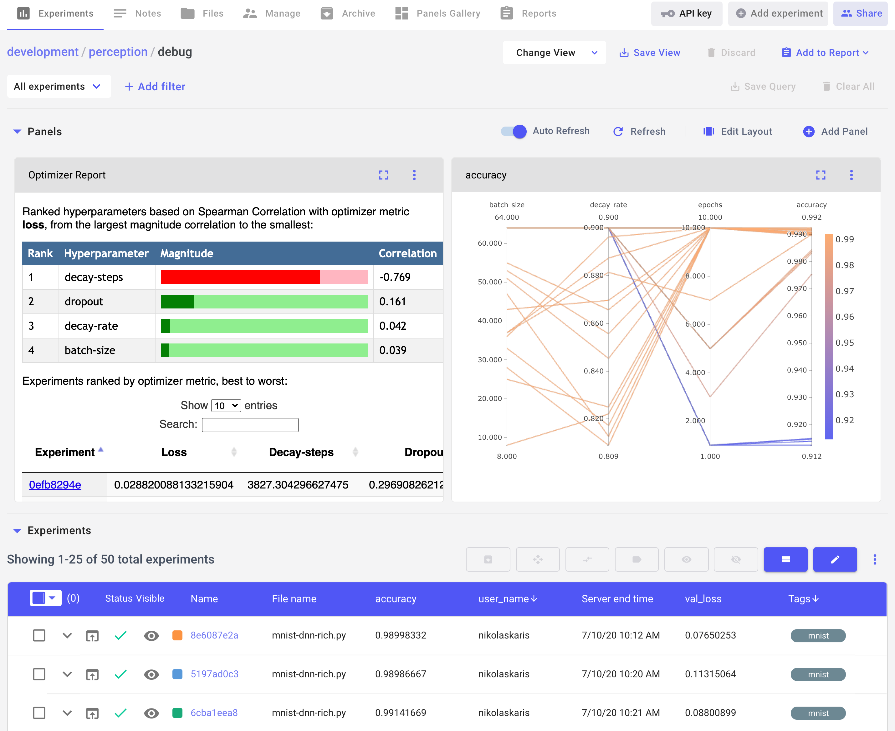
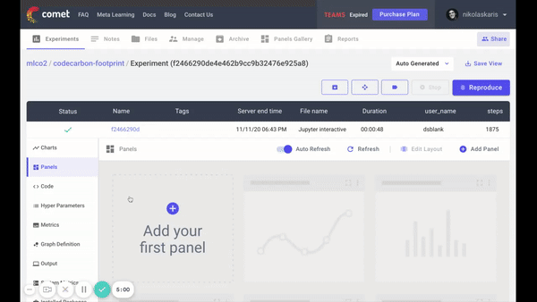
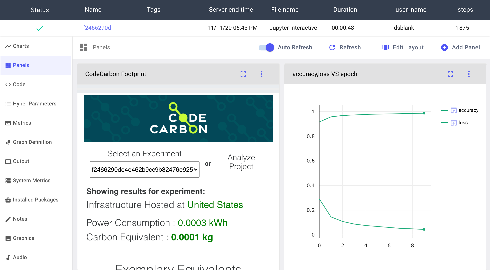

# Integrate with Comet {#comet}

CodeCarbon integrates seamlessly with [Comet](https://www.comet.ml/site/), a powerful experiment tracking and visualization platform. This integration allows you to track the carbon footprint of your machine learning experiments alongside your training metrics, hyperparameters, and other experiment details.

{.align-center width="700px" height="400px"}

## Prerequisites

Before you begin, you'll need:

1. A [Comet account](https://www.comet.ml/site/) (free tier available)
2. Your Comet API key (available in your account settings)

## Installation

Install the required Comet ML library:

``` python
pip install comet_ml>=3.2.2
```

## Setup Steps

### Step 1: Create a Comet Account

1. Go to [Comet's website](https://www.comet.ml/site/) and create a free account
2. From your account settings page, copy your personal API key

### Step 2: Configure Your Experiment

In your Python script, initialize a Comet experiment with your API key:

``` python
from comet_ml import Experiment
from codecarbon import EmissionsTracker

experiment = Experiment(api_key="YOUR API KEY")
```

### Step 3: Run Your Experiment

Run your experiment as normal. CodeCarbon will automatically create an `EmissionsTracker` object that Comet will track:

``` python
# Your training code here
model.fit(X_train, y_train)
```

### Step 4: Add the CodeCarbon Footprint Panel

Once your experiment completes, view it in the Comet UI:

1. Click on the `Panel` tab in the left sidebar
2. Click `Add Panel`
3. In the Panel Gallery, click the `Public` tab
4. Search for `CodeCarbon Footprint`
5. Add the panel to your experiment

{.align-center width="700px" height="400px"}

### Step 5: Save Your View

To automatically display the CodeCarbon visualization in future experiments, save your `View` from the `Panels` tab.

{.align-center width="700px" height="400px"}

## Example

A complete working example is available in the CodeCarbon repository at [examples/mnist-comet.py](https://github.com/mlco2/codecarbon/blob/master/examples/mnist-comet.py).

## Next Steps

- [Configure CodeCarbon](configuration.md) to customize tracking behavior
- [Send emissions data to the cloud](cloud-api.md) for additional visualization options
- Explore other logging options in [Log to External Systems](logging.md)
