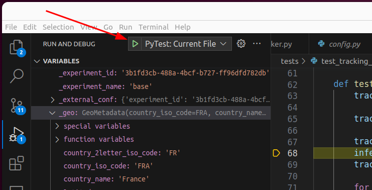

# Development guide

This page holds the deeper development material. If this is your first contribution, start
with the [contributing guide](contributing.md).

## Python versions

Between April 2024 and July 2025 we used Hatch for managing the development environment.
Since August 2025 we use UV to manage the environments, Python versions, and dependencies —
it's a fast, reliable way to work with Python projects.

We have dropped support of Python 3.6 since version 2.0.0 of CodeCarbon.

We have dropped support of Python 3.8 and 3.9 since version 3.2.4 of CodeCarbon.

## Some UV commands

UV simplifies Python package management with fast, reliable commands:

```sh
# Show dependencies
uv tree
# Add a default dependency
uv add pandas
# Add a dev dependency
uv add --dev pytest
# Add a dependency for an extra feature
uv add --optional api logfire[fastapi]
# List all task for CodeCarbon
uv run task -l
# Run a specific version of python
uv run --python 3.14 codecarbon monitor
```

## Tests

You can run the unit tests by running UV in the terminal when in the root package directory:

```sh
uv run task test-package
```

Run a specific test file:

```sh
uv run python -m pytest tests/test_cpu.py
```

You can also run a specific test:

```sh
uv run python -m unittest tests.test_your_feature.YourTestCase.test_function
```

For example: `uv run python -m unittest tests.test_energy.TestEnergy.test_wraparound_delta_correct_value`

Some tests will fail if you do not set *CODECARBON_ALLOW_MULTIPLE_RUNS* with `export CODECARBON_ALLOW_MULTIPLE_RUNS=True` before running test manually.

To test the API, see [how to run it locally](#api) first.

Core and external classes are unit tested, with one test file per class. Most pull requests are expected to contain either new tests or test updates. If you are unusure what to test / how to test it, please put it in the pull request description and the maintainers will help you.

## Stress your computer

To test CodeCarbon, it is useful to stress your computer to make it use its full power:

-   7Zip is often already installed, running it with `7z b` makes a quick CPU test.
-   [GPU-burn](https://github.com/wilicc/gpu-burn) will load test the GPU for a configurable duration.
-   To test the CPU : `stress-ng --cpu 0 --cpu-method matrixprod --metrics-brief --rapl --perf -t 60s` See [our documentation](https://docs.codecarbon.io/latest/how-to/test-on-scaleway/) to install it.
-   To do useful computation while testing [Folding At Home](https://foldingathome.org/) is a good option.
-   [OCCT](https://www.ocbase.com/download) is a proprietary tool but free for non-commercial use and available for Windows and Linux.

To monitor the power consumption of your computer while stressing it, you can use:

-   `nvidia-smi` is a useful tool to see the metrics of the GPU and compare it with CodeCarbon.
-   [powerstat](https://github.com/ColinIanKing/powerstat) can be used to see the metrics of the CPU and compare it with CodeCarbon. It's available on major distribution, like Debian-based Linux distributions with `sudo apt install powerstat`. Run it with `sudo powerstat -a -R 1 60`.

## Update all dependencies

For multiple requirement files:
```sh
uv sync --upgrade
```

## Debug in VS Code

Here is the launch.json to be able to debug examples and tests:

```json
{
    "version": "0.2.0",
    "configurations": [

        {
            "name": "Python: Current File",
            "type": "debugpy",
            "request": "launch",
            "program": "${file}",
            "console": "integratedTerminal",
            "justMyCode": true,
            "env": { "PYTHONPATH": "${workspaceRoot}" }
        },
        {
            "name": "PyTest: Current File",
            "type": "debugpy",
            "request": "launch",
            "module": "pytest",
            "args": [
                "-s",
                "${file}"
            ],
            "console": "integratedTerminal",
            "justMyCode": true,
            "env": { "PYTHONPATH": "${workspaceRoot}",
            "CODECARBON_ALLOW_MULTIPLE_RUNS": "True"  }
        },
        {
            "name": "PyTest: codecarbon monitor",
            "type": "debugpy",
            "request": "launch",
            "module": "codecarbon.cli.main",
            "args": [
                "monitor"
            ],
            "console": "integratedTerminal",
            "justMyCode": true,
            "env": { "PYTHONPATH": "${workspaceRoot}"}
        }
    ]
}
```

Then run opened test with this button:



## Coding style && Linting

The coding style and linting rules are automatically applied and enforced by [pre-commit](https://pre-commit.com/). This tool helps to maintain the same code style across the code-base such to ease the review and collaboration process. Once installed ([https://pre-commit.com/#installation](https://pre-commit.com/#installation)), you can install a Git hook to automatically run pre-commit (and all configured linters/auto-formatters) before doing a commit with `uv run task precommit-install`. Then once you tried to commit, the linters/formatters will run automatically. If any of the linters/formatters fail, check the difference with `git diff`, add the differences if there is no behavior changes (isort and black might have change some coding style or import order, this is expected it is their job) with `git add` and finally try to commit again `git commit ...`.

You can also run `pre-commit` with `uv run pre-commit run --all-file` to check all file.

## Dependencies management

Dependencies are defined in different places:

-   In [pyproject.toml](https://github.com/mlco2/codecarbon/blob/master/pyproject.toml#L28), those are all the dependencies.
-   In [uv.lock](https://github.com/mlco2/codecarbon/blob/master/uv.lock), those are the locked dependencies managed by UV, do not edit them.

## Build Documentation 🖨️

No software is complete without great documentation!
To make generating documentation easier, we use [Zensical](https://zensical.org/).

In order to make changes, edit the `.md` files in the `/docs` folder, and then run in root folder:

```sh
uv run --only-group doc task docs
```

to regenerate the html files. For local preview with live reload, run `uv run --only-group doc task docs-serve`.

## Rebase your branch on master

Before creating a PR, please make sure to rebase your branch on master to avoid merge conflicts and make the review easier. You can do it with the following command:
```sh
# Be careful, this command will delete every local changes you have, make sure to commit or stash them before running it
TARGET_BRANCH=master
current_branch=$(git symbolic-ref --short HEAD)
git switch $TARGET_BRANCH && git pull
git switch $current_branch --force && git fetch origin $TARGET_BRANCH
git rebase $TARGET_BRANCH
```

In case of a conflict during a rebase, "incoming" refers to your branch, and "current" refers to master. This is because the commits from your branch are being applied to master, so they are incoming. In case of a merge, it's the opposite!

Check if everything is fine:

```sh
git status
```

Push force
```sh
git push --force-with-lease
```

## Contribute to a fork branch

When a user open a PR from a fork, we are allowed to push to the fork branch.

If you want to do so, do the following:

```bash
git remote add <user_name> https://github.com/<user_name>/codecarbon.git
git fetch <user_name> <git_branch>
git checkout -b <git_branch> <user_name>/<git_branch>
```

## API and Dashboard

### CSV Dashboard

To run locally the dashboard application, you can use it out on a sample data file such as the one in `examples/emissions.csv`, and run it with the following command from the code base:

```bash
uv run --extra carbonboard task carbonboard --filepath="examples/emissions.csv"

# or, if you don't want to use UV
pip install codecarbon[carbonboard]
python codecarbon/viz/carbonboard.py --filepath="examples/emissions.csv"
```

> **Note:** The `viz-legacy` extra is deprecated but still works for backwards compatibility. It will be removed in v4.0.0. Please use `carbonboard` instead.

If you have the package installed, you can run the CLI command:

```bash
carbonboard --filepath="examples/emissions.csv" --port=8050
```

### Web dashboard

To test the new dashboard that uses the API, run:

```sh
cd webapp && pnpm dev
```

Then, click on the url displayed in the terminal.

By default, the dashboard is connected to the production API, to connect it to your local API, you can set the environment variable `CODECARBON_API_URL` to `http://localhost:8008` :

```sh
export CODECARBON_API_URL=http://localhost:8008
cd webapp && pnpm dev
```

### API

The easiest way to run the API locally is with Docker, it will set-up the Postgres database for you. Launch this command in the project directory:

```sh
uv run task docker

# or

docker-compose up -d
```

Please see [Docker specific documentation](https://github.com/mlco2/codecarbon/blob/master/docker/README.md) for more informations.
When up, the API documentation is available locally at the following URL: http://localhost:8008/redoc and can be used for testing.

If you want to run the API without Docker, you must first set the environment variables described in the .env.example file, and run the following command:

```sh
uv run task dashboard
```

In order to make codecarbon automatically connect to the local API, create a file `.codecarbon.config` with contents:

```
[codecarbon]
api_endpoint = http://localhost:8008
```

Before using it, you need an experiment_id, to get one, run:

```
codecarbon login
```

It will ask the API for an experiment_id on the default project and save it to `.codecarbon.config` for you.

Then you could run an example:

```
python examples/api_call_debug.py
```

📝 Edit the line `occurence = 60 * 24 * 365 * 100` to specify the number of minutes you want to run it.

### Test the API

Test dependencies (pytest, pytest-asyncio, etc.) are in the `dev` optional group. Install them first:

```sh
uv sync --project carbonserver --extra dev
```

Then run:

```sh
uv run task test-api-unit
```

```sh
export CODECARBON_API_URL=http://localhost:8008
uv run task test-api-integ
```

Database restore, deployment and the release process live in the
[maintainer guide](../maintaining.md).
