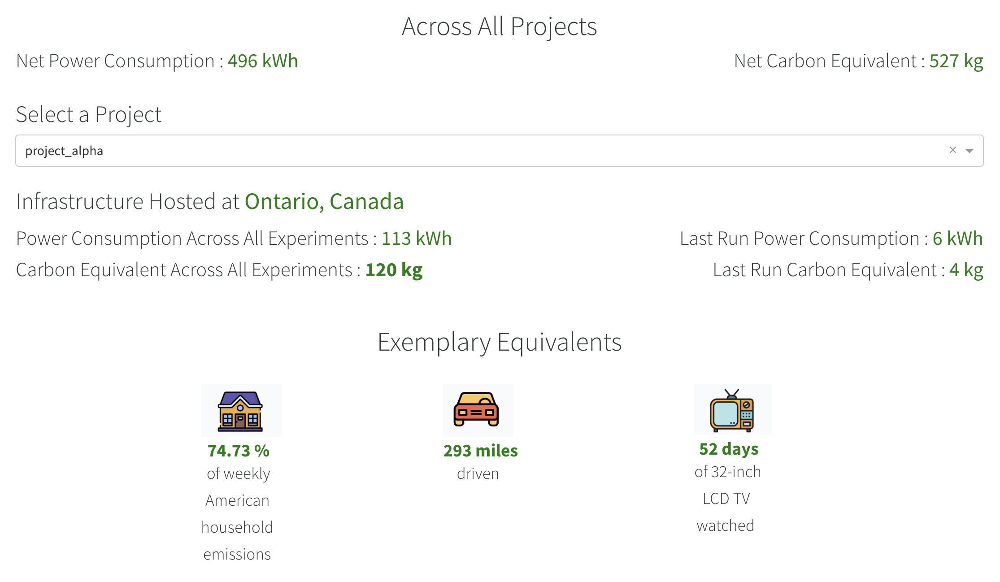
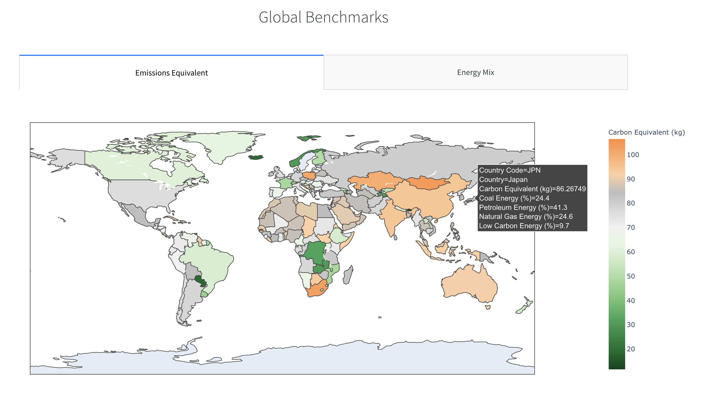
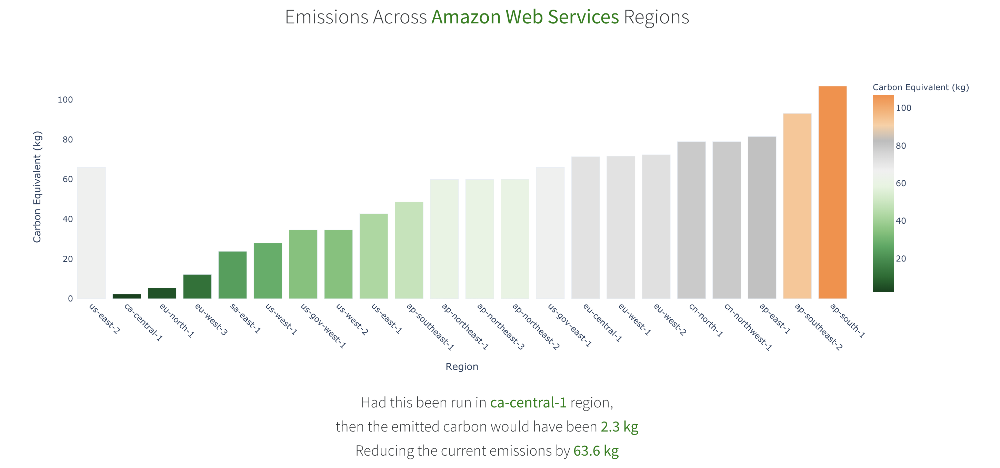
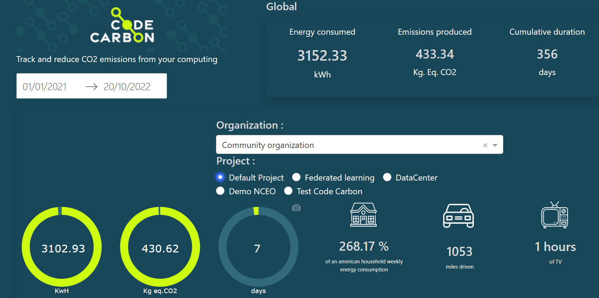
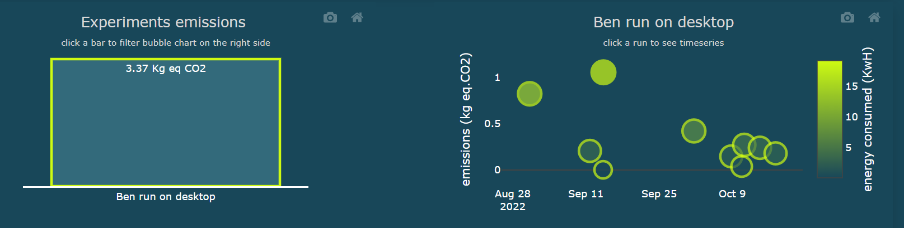
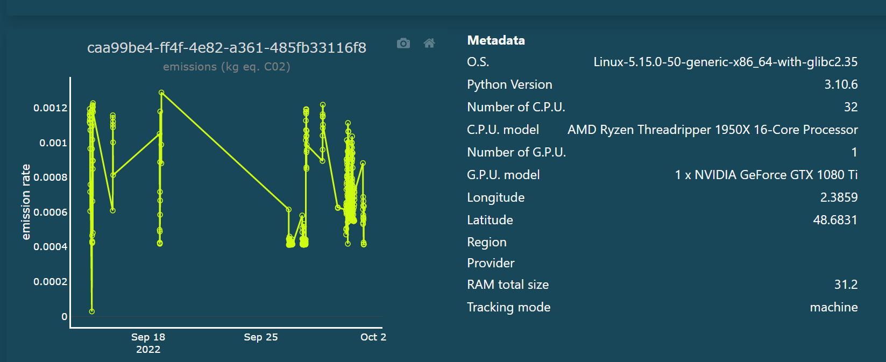
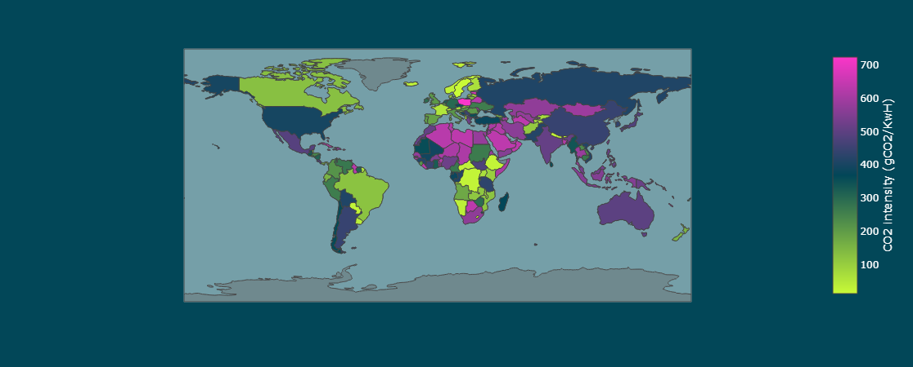

# Visualize

CodeCarbon provides two ways to visualize your emissions data: a local Python dashboard for offline analysis, and an online web dashboard for cloud-based tracking and team collaboration.

## Offline Visualization (carbonboard)

The CodeCarbon package includes a local Python dashboard (`carbonboard`) for visualizing emissions data from CSV logs. This is useful for analyzing experiments offline or in environments without internet access.

### Step 1: Installation

The carbonboard visualization tool requires additional dependencies.
Install them with:

``` bash
pip install 'codecarbon[carbonboard]'
```

!!! note "Note"

    The `viz-legacy` extra is deprecated but still works for backwards
    compatibility. It will be removed in v4.0.0. Please use `carbonboard`
    instead.

### Step 2: Launch the Dashboard

Run the carbonboard application with your emissions data:

``` bash
carbonboard --filepath="examples/emissions.csv" --port=3333
```

**Parameters:**

- `--filepath`: Path to the CSV file containing your emissions data
- `--port`: Optional port number (default is 8050)

Then open your browser to `http://localhost:3333` to view the dashboard.

### Dashboard Features

#### Summary and Equivalents

Users can get an understanding of net power consumption and emissions
generated across projects and can dive into a particular project. The
App also provides exemplary equivalents from daily life, for example:

- Weekly Share of an average American household
- Number of miles driven
- Time of 32-inch LCD TV watched

{.align-center width="700px" height="400px"}

#### Regional Comparisons

Benchmark your emissions against electricity grids across different countries to understand regional variations in carbon intensity:

{.align-center width="750px" height="480px"}

#### Cloud Regions

The App also benchmarks equivalent emissions across different regions of
the cloud provider being used and recommends the most eco-friendly
region to host infrastructure for the concerned cloud provider.

{.align-center width="750px" height="450px"}

## Online Dashboard

For team-based tracking and cloud-hosted visualization, use the [CodeCarbon online dashboard](https://dashboard.codecarbon.io/). To get started, follow the [Cloud API setup guide](cloud-api.md).

### Cloud Dashboard Features

#### Organization & Project Overview

Showing on the top the global energy consumed and emissions produced at
an organisation level and the share of each project in this. The App
also provides comparison points with daily life activity to get a better
understanding of the amount generated.

{.align-center width="750px"}

The top shows your organization-level energy consumption and emissions, broken down by project. CodeCarbon also provides real-world comparisons (weekly US household emissions, miles driven, etc.).

#### Experiments, Runs & Detailed Metrics

Each project contains experiments, and each experiment can have multiple runs. The bar chart shows total emissions per experiment, while the bubble chart displays individual runs. Click on bars to switch between experiments, and click on bubbles to see detailed time-series data and metadata.

{.align-center width="750px"}

#### Drill Down Into a Run

Click on any bubble to see the full time-series graph and detailed metadata for that run, including timestamps, energy breakdowns, and hardware information.

{.align-center width="750px"}

#### Electricity Production Carbon Intensity per Country

The app also provides a visualization of regional carbon intensity of electricity production, helping you understand the environmental impact of different deployment regions.

{.align-center width="750px"}

## Next Steps

- [Set up the Cloud API](cloud-api.md) to send data to the online dashboard
- [Configure CodeCarbon](configuration.md) for additional tracking options
- [Integrate with experiment tracking tools](comet.md) like Comet for seamless workflow integration
