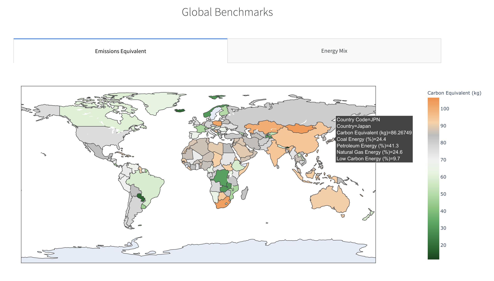
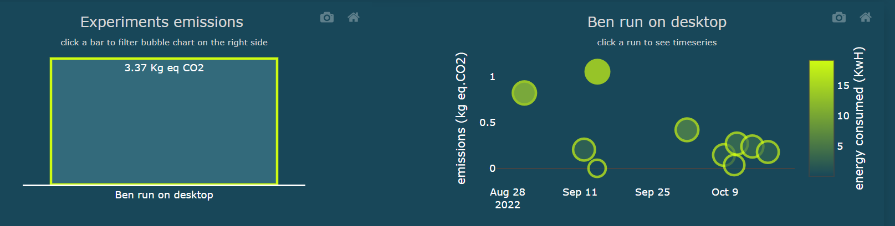
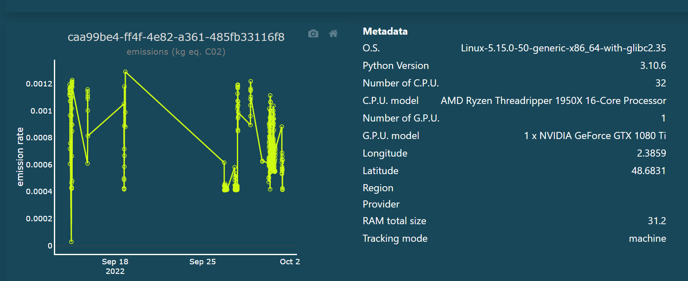

# Visualize

## Offline

The package also comes with a `Dash App` containing illustrations to
understand the emissions logged from various experiments across
projects. The App currently consumes logged information from a CSV file,
generated from an in-built logger in the package.

### Installation

The carbonboard visualization tool requires additional dependencies.
Install them with:

``` bash
pip install 'codecarbon[carbonboard]'
```

!!! note "Note"

    The `viz-legacy` extra is deprecated but still works for backwards
    compatibility. It will be removed in v4.0.0. Please use `carbonboard`
    instead.

### Usage

The App can be run by executing the below CLI command that needs
following arguments:

-   `filepath` - path to the CSV file containing logged information
    across experiments and projects
-   `port` - an optional port number, in case default \[8050\] is used
    by an existing process

``` bash
carbonboard --filepath="examples/emissions.csv" --port=3333
```

### Summary and Equivalents

Users can get an understanding of net power consumption and emissions
generated across projects and can dive into a particular project. The
App also provides exemplary equivalents from daily life, for example:

-   Weekly Share of an average American household
-   Number of miles driven
-   Time of 32-inch LCD TV watched

{.align-center width="700px" height="400px"}

### Regional Comparisons

The App also provides a comparative visual to benchmark emissions and
energy mix of the electricity from the grid across different countries.

{.align-center width="750px" height="480px"}

### Cloud Regions

The App also benchmarks equivalent emissions across different regions of
the cloud provider being used and recommends the most eco-friendly
region to host infrastructure for the concerned cloud provider.

{.align-center width="750px" height="450px"}

## Online

A dashboard is also available for those who chose to connect the package
to the public API. [Got to online
dashboard](https://dashboard.codecarbon.io/)

### from global\...

Showing on the top the global energy consumed and emissions produced at
an organisation level and the share of each project in this. The App
also provides comparison points with daily life activity to get a better
understanding of the amount generated.

{.align-center width="750px"}

### to more and more\...

Each project can be divided into several experiments, and in each
experiment several runs can happen. The total emissions of experiments
is shown on the barchart on the right hand side, and the runs on the
bubble chart on the left hand side. If ever your project has several
experiments you can switch from one experiment's runs in the bubble
chart to another by clicking the bar chart.

{.align-center width="750px"}

### detailed

Clicking on one bubble, you can display the runtime series and see its
metadata.

{.align-center width="750px"}

### Electricity production carbon intensity per country

The app also provides a visualization of regional carbon intensity of
electricity production.

{.align-center width="750px"}
