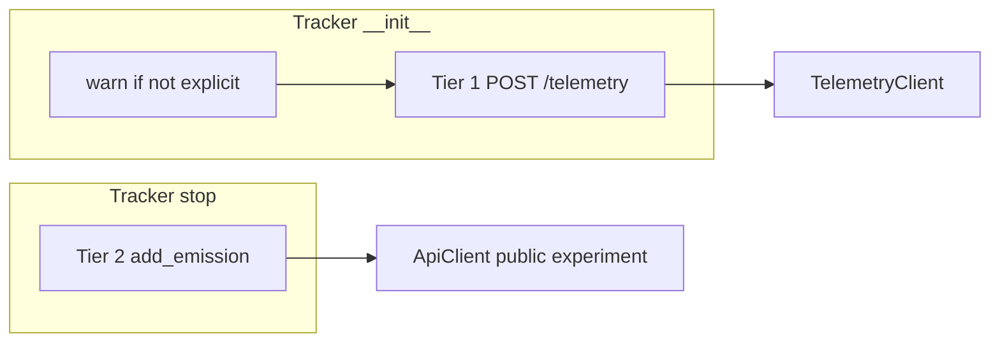

# Telemetry Tier Configuration Implementation Plan

> **For Claude:** REQUIRED SUB-SKILL: Use executing-plans to implement this plan task-by-task.

**Goal:** Configure telemetry tiers (`disabled`, `minimal`, `extensive`) with clear defaults, explicit opt-in/out, and optional public emissions on stop. Aligned with issue #1106 and `TelemetryLevel` from PR #1171.

**Architecture (shipped):** Tier resolution: **tracker `telemetry_level` kwarg** (if set) → else **`telemetry_level` in `.codecarbon.config`**. Env `CODECARBON_TELEMETRY` / `telemetry` does **not** change the tier (only counts as “explicit” for the configure warning). API URL/key/experiment: config → env → `DEFAULT_*` in `telemetry_settings.py`. **Tier 1:** `TelemetryClient` → `POST /telemetry` once per session on init (404 logged as warning until prod deploy). **Tier 2:** `ApiClient.add_emission` to public experiment on `stop()` when `extensive`. One-time **warning** if tier was not set explicitly. No `send_telemetry` bool.

**Tech Stack:** Python 3.11+, Pydantic v2, `configparser`, Typer CLI, `pytest`, `requests` / `requests_mock`.

**Base branch:** `feat/add-telemetry` (stacked on `feat/telemetry-backend`, PR #1200)

**Related:**
- Issue: [#1106](https://github.com/mlco2/codecarbon/issues/1106)
- Backend: [PR #1171](https://github.com/mlco2/codecarbon/pull/1171)
- Client integration: [PR #1200](https://github.com/mlco2/codecarbon/pull/1200)
- CLI import fix (separate, to `master`): [PR #1201](https://github.com/mlco2/codecarbon/pull/1201) — `amdsmi` / `libamd_smi.so` on macOS

---

## Configuration contract (current)

### What users can configure where

| Setting | Config file | Env | Python kwarg | CLI | Default |
|---------|-------------|-----|--------------|-----|---------|
| **`telemetry_level`** (tier) | ✅ | ❌ (tier) / ✅ (explicit warning only)¹ | ✅ `telemetry_level=` | ✅ see below | `minimal` |
| `telemetry_api_url` | ✅ | `CODECARBON_TELEMETRY_API_URL` | ❌ | ❌ | `DEFAULT_TELEMETRY_API_URL` |
| `telemetry_api_key` | ✅ | `CODECARBON_TELEMETRY_API_KEY` | ❌ | ❌ | `DEFAULT_TELEMETRY_API_KEY` |
| `telemetry_experiment_id` | ✅ | `CODECARBON_TELEMETRY_EXPERIMENT_ID` | ❌ | ❌ | `DEFAULT_TELEMETRY_EXPERIMENT_ID` |

¹ `CODECARBON_TELEMETRY_LEVEL` or legacy `CODECARBON_TELEMETRY` suppress the “not configured” warning but do **not** change the resolved tier unless also in config or passed as kwarg.

**CLI for `telemetry_level`:**

| Command | Persists to config? | Notes |
|---------|---------------------|--------|
| `codecarbon telemetry` | ✅ | Interactive wizard |
| `codecarbon telemetry set <level>` | ✅ | `disabled` \| `minimal` \| `extensive` |
| `codecarbon telemetry show` | — | Read resolved tier |
| `codecarbon monitor --telemetry-level <level>` | ❌ | One-run override only (tracker kwarg) |

Separate from `codecarbon config` (dashboard org/project/experiment).

### Tier values

| Value | Tier | On init | On stop | Visibility (product) |
|-------|------|---------|---------|----------------------|
| `disabled` | 0 | — | — | None |
| `minimal` | 1 | Tier 1 `POST /telemetry` (once/session) | — | Private metadata |
| `extensive` | 2 | Tier 1 `POST /telemetry` (once/session) | Tier 2 `add_emission` | Public leaderboard |

### Default when not explicit

If the user never sets `telemetry_level` (no config key, no kwarg, no env key counted as explicit):

1. **Warning** (once per Python session): default is `minimal`; **Tier 1 minimal telemetry will be sent** once per session.
2. **Behaviour:** same as `telemetry_level = minimal` (Tier 1 HTTP on init).

### Explicit configuration (no warning)

Any of:

- `telemetry_level = …` in `.codecarbon.config` (local or global)
- `EmissionsTracker(telemetry_level="…")` / `OfflineEmissionsTracker` / `@track_emissions`
- `codecarbon telemetry set …` (writes config)
- `codecarbon monitor --telemetry-level …` (run override; counts as explicit for that run)
- `CODECARBON_TELEMETRY_LEVEL` or `CODECARBON_TELEMETRY` in the environment

### Tier resolution precedence

1. Tracker kwarg `telemetry_level` (CLI `--telemetry-level` or Python arg)
2. `telemetry_level` in config file (local overrides global)
3. Built-in default: `minimal`

### `.codecarbon.config` example

```ini
[codecarbon]
telemetry_level = minimal
telemetry_api_url = https://api.codecarbon.io
telemetry_api_key = cpt_...
telemetry_experiment_id = aa69b440-014a-4562-ac06-ba7eecb023f9
```

### Tests disabling telemetry

```ini
[codecarbon]
telemetry_level = disabled
```

Pattern: `get_custom_mock_open("[codecarbon]\ntelemetry_level = disabled\n", ...)`.

---

## Out of scope

- `codecarbon config` wizard step for telemetry (use `codecarbon telemetry` instead)
- `CODECARBON_TELEMETRY` env var **changing** the tier (legacy key only affects “explicit” warning)
- First-run consent prompt, Alembic migration
- Leaderboard UI / server-side public visibility enforcement

---

## Task 1: Telemetry settings module ✅

**Files:** `codecarbon/core/telemetry_settings.py`, `codecarbon/core/config.py`, `tests/test_telemetry_settings.py`, `tests/test_config_file_settings.py`

**Done:**
- `DEFAULT_TELEMETRY_*` constants and `get_telemetry_api_*` helpers
- `get_config_file_settings()` — file only
- `resolve_telemetry_level(config_file_conf, override=…)` — kwarg overrides config
- `is_telemetry_level_explicit(config_file_conf, override=…, external_conf=…)`

---

## Task 2: `codecarbon/telemetry.py` ✅

**Done:**
- `build_minimal_telemetry_dict` / `send_tier1_telemetry` — `TelemetryClient` → `POST /telemetry` + `x-api-token`; session dedup `_TIER1_SENT`; HTTP 404 → warning
- `send_tier2_public_emission` — `ApiClient` + `add_emission` to public experiment; `_TIER2_SENT`
- `warn_if_telemetry_not_configured` — one-time warning; message states Tier 1 will be sent
- Tests in `tests/test_telemetry.py`

---

## Task 3: Tracker wiring ✅

**Files:** `codecarbon/emissions_tracker.py`



```python
self._config_file_conf = get_config_file_settings()
telemetry_override = None if telemetry_level is _sentinel else telemetry_level
self._telemetry_level = resolve_telemetry_level(self._config_file_conf, override=telemetry_override)
self._apply_init_telemetry(telemetry_override)   # warn + Tier 1 when minimal/extensive
# stop():
self._maybe_send_tier2_telemetry(emissions_data_delta)  # extensive only
```

| Config | Init | Stop |
|--------|------|------|
| `disabled` | — | — |
| `minimal` | Tier 1 HTTP | — |
| `extensive` | Tier 1 HTTP | Tier 2 `add_emission` |

Independent of `save_to_api`. Best-effort; never blocks tracker.

---

## Task 4: Extensive `POST /telemetry` payload ⏸

Deferred — Tier 2 is public `add_emission` only.

---

## Task 5: Config integration tests ✅

**File:** `tests/test_telemetry_config.py`

- Tier behaviour per config (`disabled` / `minimal` / `extensive`)
- Env does not change tier; env API URL for Tier 2
- Warning when config empty; no warning when config or kwarg explicit
- Tier 1 asserts `TelemetryClient` / `POST /telemetry` (mocked in unit tests)

---

## Task 6: Telemetry CLI ✅

**Files:** `codecarbon/cli/telemetry_cli.py`, `codecarbon/cli/main.py`, `tests/cli/test_telemetry_cli.py`

**Done:**
- `codecarbon.add_typer(telemetry_app, name="telemetry")`
- `codecarbon telemetry` — interactive (`questionary`): pick config path + tier
- `codecarbon telemetry set <level> [--config PATH]` — write `telemetry_level`
- `codecarbon telemetry show [--config PATH]` — resolved tier + explicit flag
- `codecarbon monitor --telemetry-level <level>` — one-run override via tracker kwarg
- `parse_telemetry_level()` (core) + `normalize_telemetry_level()` (CLI Typer wrapper)
- `telemetry show` uses merged file settings by default (matches tracker)

**Not done:** optional hook at end of `codecarbon config` wizard (deferred).

---

## Task 7: Documentation ✅

**Files:** `docs/how-to/telemetry.md`, `docs/reference/cli.md`, `mkdocs.yml`, link from `docs/how-to/configuration.md`

**Done:**
- User-facing telemetry how-to with tiers, config, CLI, Python opt-out
- Tier 1 documents **only fields sent today** by `build_minimal_telemetry_dict` plus explicit “not collected yet” list
- CLI reference: `codecarbon telemetry`, `--telemetry-level`

---

## Task 8: PR hygiene ✅

```bash
uv run pytest tests/test_telemetry_settings.py tests/test_config_file_settings.py \
  tests/test_telemetry.py tests/test_telemetry_config.py tests/test_telemetry_client.py \
  tests/cli/test_telemetry_cli.py -v
uv run pytest tests/test_emissions_tracker.py tests/test_offline_emissions_tracker.py -q
uv run pytest carbonserver/tests/api/test_telemetry_schema_drift.py -v
uv run task test-package
```

**Results (2026-05-19):** 62 telemetry tests, 22 tracker tests, schema drift, **527** package unit tests passed.

- [x] Public `DEFAULT_TELEMETRY_API_KEY` / `DEFAULT_TELEMETRY_EXPERIMENT_ID`
- [x] `telemetry_level` kwarg on tracker + `@track_emissions`
- [x] Configure warning + Tier 1 HTTP when not explicit
- [x] Telemetry CLI + `monitor --telemetry-level`
- [x] No `send_telemetry`; tests use config mocks
- [x] Full package test suite green (`uv run task test-package`)
- [x] Schema drift test passes
- [x] `test_config.py` isolates `get_config_file_settings` (no leak from real `~/.codecarbon.config`)
- [x] `test_gpu.py` amdsmi warning message aligned with `gpu_amd.py`
- [x] `ApiClient._create_run` handles `longitude`/`latitude` `None`

---

## Related fix (separate PR, not telemetry feature)

**[PR #1201](https://github.com/mlco2/codecarbon/pull/1201)** → `master`: `codecarbon/core/gpu_amd.py` catches `KeyError` / `OSError` when `amdsmi` is installed but `libamd_smi.so` is missing (macOS CLI crash). Branch: `fix/amdsmi-import-keyerror-macos`.

---

## Risk notes

| Risk | Mitigation |
|------|------------|
| Users surprised by default Tier 1 logging | One-time warning names Tier 1 explicitly |
| Env `CODECARBON_TELEMETRY` confusion | Document: warning-only, not tier resolution |
| Tier 1 log vs future HTTP | Doc + comment in `send_tier1_telemetry`; flip when API ready |
| CLI import before amdsmi fix merged | PR #1201 to master; rebase `feat/add-telemetry` after merge |

---

## Progress summary

| Task | Status |
|------|--------|
| 1. Telemetry settings | ✅ |
| 2. `telemetry.py` | ✅ |
| 3. Tracker wiring | ✅ |
| 4. Extensive `/telemetry` POST | ⏸ |
| 5. Integration tests | ✅ |
| 6. Telemetry CLI | ✅ |
| 7. Documentation | ✅ |
| 8. Full CI / PR hygiene | ✅ |

---

## Execution handoff

**Next step:** Merge PR #1200; rebase after [PR #1201](https://github.com/mlco2/codecarbon/pull/1201); deploy [#1171](https://github.com/mlco2/codecarbon/pull/1171) so prod `/telemetry` stops returning 404.
